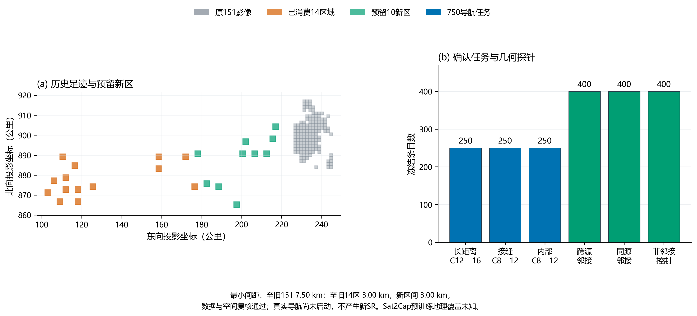

# 径向保护新区域确认：数据准备报告

2026-10-03。**数据工程与空间隔离复核通过，尚无新SR。** 候选与默认M0保持，下一项为固定新区域上的导航确认。

## 数据来源与固定选择

作者Massachusetts Roads发布影像的冻结1108文件清单，发布像素1米，EPSG:26986。排除原151幅M0源影像及已消费14连续区域的整个足迹，另按固定文件坐标顺序、3公里缓冲和既定空白像素阈值取最早10个合格区域，不以模型分数挑区。公共下载来源为[作者数据目录](https://www.cs.toronto.edu/~vmnih/data/)。上游train标签不等于项目训练；Sat2Cap预训练地理范围未知。

只读复用原152下载源。新获取102张，响应体658.15 MiB；新增上限200张/1.5 GiB（含失败重试）。选中40幅源图中40幅本轮新增、0幅来自从未用于模型预测的只读旧下载。旧原图未复制、移动或覆盖。候选组302，完整质量/几何拒绝数40，详见元数据记录。

| 新区 | 源图（UL/UR/LL/LR） | 至旧151最短公里 | 至旧14区最短公里 |
|---|---|---:|---:|
| img_3000 | 17728915_15 / 17878915_15 / 17728900_15 / 17878900_15 | 46.500 | 3.000 |
| img_3001 | 18178765_15 / 18328765_15 / 18178750_15 / 18328750_15 | 44.116 | 3.000 |
| img_3002 | 18778750_15 / 18928750_15 / 18778735_15 / 18928735_15 | 39.000 | 9.000 |
| img_3003 | 19678660_15 / 19828660_15 / 19678645_15 / 19828645_15 | 35.781 | 18.974 |
| img_3004 | 19978915_15 / 20128915_15 / 19978900_15 / 20128900_15 | 24.000 | 24.965 |
| img_3005 | 20128975_15 / 20278975_15 / 20128960_15 / 20278960_15 | 22.500 | 27.372 |
| img_3006 | 20578915_15 / 20728915_15 / 20578900_15 / 20728900_15 | 18.000 | 30.187 |
| img_3007 | 21178915_15 / 21328915_15 / 21178900_15 / 21328900_15 | 12.000 | 35.655 |
| img_3008 | 21478990_15 / 21628990_15 / 21478975_15 / 21628975_15 | 9.000 | 40.942 |
| img_3009 | 21629050_15 / 21779050_15 / 21629035_15 / 21779035_15 | 7.500 | 43.681 |

最短闭合矩形间距：新区域至原151为7500.000米、至已消费14区为3000.000米；新区域彼此为3000.000米。区域源图连续性、GeoTIFF标签和逐像素内容都独立核验，不能只凭文件名或中心距离认定隔离。

## 固定输入与评测权限

10区×9 km²、每格300米、10×10/B20，共1000个原生300×300图块、10幅无融合/无重采样拼接影像。750个不同导航路线（每区每层25题，三层各250）；1200个几何匹配探针（跨源、同源、非邻接各400），探针不计SR。错目标初始距离不能匹配的例外41条，固定保留。

采样seed6203/错目标seed6211；JPEG质量75与旧输入逻辑一致。保存每格来源图、像素窗口、投影边界、原生/JPEG/文件SHA。数据使用账本全部为预留确认角色：编码器、头部、导航均未调用。只对真实任务reset750次检查接口，没有在真实新区执行动作。

## 核验与结论范围

12项新增检查通过。独立实现以tifffile解析全部源标签/RGB、重做固定次序选择、重建10幅拼接及1000个JPEG、复算750任务和1200探针，验证下载/重试/复用账本、空间缓冲与冻结哈希。算术实现由同一会话执行，不冒称另一位人工审阅者。原数据、模型、历史结果和默认SHA保持。

本阶段通过只说明有可追溯的独立确认输入，不能认为候选已在新区域提高SR，也不能替换默认。仍是同Massachusetts发布影像家族的本地切图仿真，不证明编码器未见当地，不是任意角度、异时、跨模态或实飞结果。

[数据清单](工程数据/数据清单.json) / [任务](工程数据/导航任务.json) / [选择与拒绝](元数据/连续区域选择.json) / [使用状态](元数据/本项目模型使用状态.json) / [独立复核](核验/独立复核.json) / [判定](核验/验收结论.json) / [冻结导航草案](下一项冻结径向保护新区域导航确认方案_v1.md)。

图注：数据准备阶段，仅元数据和固定像素质量筛选；无导航模型、编码器或视觉头预测。左图为EPSG:26986闭合足迹，包含原151影像、已消费14连续区域及10个预留确认新区；轴用投影公里，不是经纬度。新旧及新区之间的最短矩形距离独立核验均至少3公里。右图为冻结750条不同导航任务的三个分层（各250）和1200个匹配目标几何探针的三个类别（各400）；探针不计入导航SR。每新区9 km²、300米/格、10×10/B20，共40幅选中源图及1000图块。该图不包含新的模型成功率。
