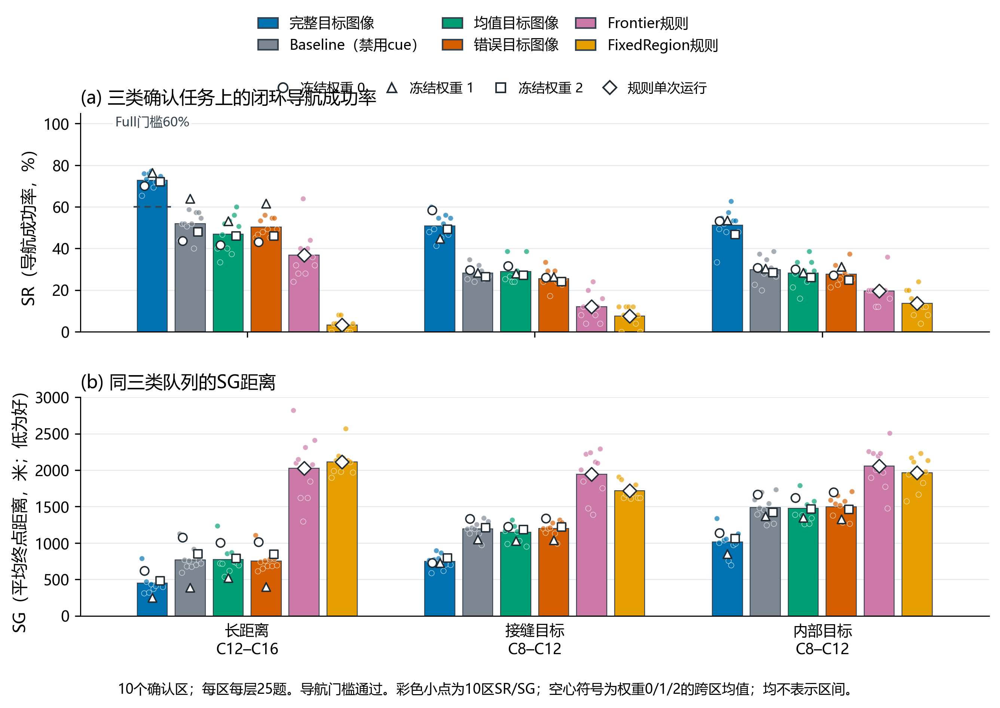
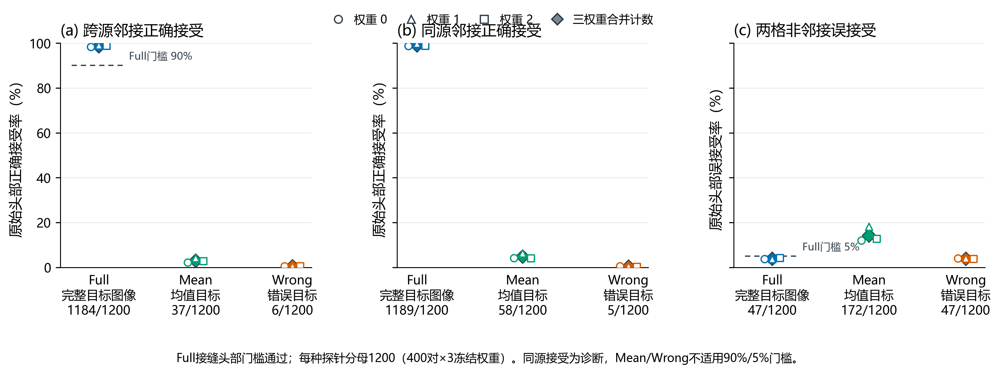

# 新空间隔离区域M0导航确认报告

**组合门槛通过：导航确认通过；接缝头部可靠性通过。** 原S2/S3/S4判定与本地默认保持不变。

## 范围与固定预算

本轮只确认冻结M0在本项目本地导航训练/开发足迹之外的新区域上的闭环表现，以及独立接缝探针的原始头部可靠性。使用Massachusetts Roads发布影像，同属Massachusetts影像发布系列；工程与确认区域各为单区9 km²、300米网格、10×10/B20，14区合计126 km²是分离足迹面积之和，不是一张连续地图。区域规则为相对本地旧151个Masa足迹及新区域彼此空间隔离；这不证明Sat2Cap编码器预训练没有见过这些地点，也不是跨数据集、跨成像域或全球未见保证。

| 阶段 | 区域数 | 唯一导航任务 | 神经轨迹 | 规则轨迹 | 探针头部判断 |
|---|---:|---:|---:|---:|---:|
| 工程接口 | 4 | 300 | 3600 | 600 | 4320 |
| 独立确认 | 10 | 750 | 9000 | 1500 | 10800 |
| 合计 | 14 | 1050 | 12600 | 2100 | 15120 |

工程阶段4区、300任务、4200闭环记录及4320探针均通过独立复核；其SR不作选型门槛。确认阶段10区、750条不重复路线、10500闭环记录及10800探针均通过独立复核。全轮共14700条导航终局记录、15120个头部判断。每区75个任务：25长距离C12–C16、25接缝目标C8–C12、25内部目标C8–C12；后两层距离较短，始终分开报告。

### 工程关观察值（不用于选型）

| 条件 | SR | 平均SG（米） | 题数 |
|---|---:|---:|---:|
| 完整目标图像 | 61.00% | 4986.7 | 670.7 | 351 | 1719.7 | 900 |
| Baseline（禁用cue） | 38.33% | 5414.3 | 1125.0 | 555 | 1824.3 | 900 |
| 均值目标图像 | 36.67% | 5482.3 | 1105.0 | 570 | 1744.7 | 900 |
| 错误目标图像 | 36.00% | 5487.3 | 1134.7 | 576 | 1772.9 | 900 |
| Frontier规则 | 25.33% | 5595.0 | 2001.0 | 224 | 2679.9 | 300 |
| FixedRegion规则 | 9.33% | 5879.0 | 1925.0 | 272 | 2123.2 | 300 |

固定模型来源为此前的main、Small256 NoTarget探索器及EdgeTargetCue头的三份冻结权重和原均值。没有新训练或云端调用，0.50原始概率阈值、合法动作/未访问格门控、Frontier与FixedRegion规则、默认配置均保持。Full会使用给定目标图像；Baseline禁用cue；Mean将cue特征均值遮蔽；Wrong使用预先冻结的错误目标。三份权重全部报告，不挑最高种子、不集成。

## 确认集总体结果

下表对每个神经条件合并3份冻结权重，因此分母为2250；两条规则各执行一次，分母为750。混合750题的SR只作描述，不代替长距离主队列或完整通过判定。平均实际移动距离是每题沿合法移动累积的路径长度，越界原地消耗一步但不增加距离；SG是终点曼哈顿距离，成功记0，单位已换算为米。两者一个反映走过的路径，一个反映终点距目标的距离。失败平均SG只对失败题求均值。

| 条件 | 成功数/分母 | SR | 平均实际移动距离（米） | 平均SG终点距离（米） | 失败数 | 失败平均SG（米） |
|---|---:|---:|---:|---:|---:|---:|
| 完整目标图像 | 1311/2250 | 58.27% | 5045.2 | 738.3 | 939 | 1769.0 |
| Baseline（禁用cue） | 824/2250 | 36.62% | 5424.8 | 1150.9 | 1426 | 1816.0 |
| 均值目标图像 | 780/2250 | 34.67% | 5486.1 | 1132.0 | 1470 | 1732.7 |
| 错误目标图像 | 776/2250 | 34.49% | 5462.7 | 1148.8 | 1474 | 1753.6 |
| Frontier规则 | 171/750 | 22.80% | 5661.6 | 2008.0 | 579 | 2601.0 |
| FixedRegion规则 | 61/750 | 8.13% | 5883.2 | 1931.2 | 689 | 2102.2 |

## 三个预登记队列

长距离门槛只检验CueFull在250道C12–C16任务×3权重上的SR≥60%。Baseline、CueMean、CueWrong分别要求：长距离配对SR提高至少5个百分点、至少2/3权重有正增益、主队列和完整750题混合队列SG均不变差、10个区域成组4000次bootstrap的SR增益95%区间下界大于0。全部条件同时成立才报告导航确认通过。

配对表中的SG变化按Full减去对照计算，负值表示Full的平均终点更近。

导航判定：**通过**。CueFull长距离SR为72.80%（546/750），项目门槛为≥60%；该门槛与三项目标对照的配对要求同时满足才构成导航通过。 所有预登记导航子门槛均满足。

| 对照（Full − 对照） | 主队列SR差 | 正向权重 | SG变化（米） | 95%区域bootstrap SR差区间 | 每项门槛 |
|---|---:|---:|---:|---:|---|
| Baseline（禁用cue） | +20.93个百分点 | 3/3 | -320.0 | [+18.27个百分点, +24.13个百分点] | SR≥5pp 通过；正向≥2 通过；主SG不差 通过；全体SG不差 通过；区间下界>0 通过 |
| 均值目标图像 | +25.87个百分点 | 3/3 | -321.6 | [+20.27个百分点, +31.87个百分点] | SR≥5pp 通过；正向≥2 通过；主SG不差 通过；全体SG不差 通过；区间下界>0 通过 |
| 错误目标图像 | +22.53个百分点 | 3/3 | -300.4 | [+20.27个百分点, +24.93个百分点] | SR≥5pp 通过；正向≥2 通过；主SG不差 通过；全体SG不差 通过；区间下界>0 通过 |

以下分层表保留三种队列与全部六个条件的失败结果，分母分别为神经条件750条（250题×3权重）和规则条件250条。失败SG单独计数/不被SR成功行抵消；SG对任何门槛的用法以预登记配对比较为准。

### 长距离锚点 C12–C16

| 条件 | 成功数/分母 | SR | 平均实际移动距离（米） | 平均SG终点距离（米） | 失败数 | 失败平均SG（米） |
|---|---:|---:|---:|---:|---:|---:|
| 完整目标图像 | 546/750 | 72.80% | 5094.0 | 450.8 | 204 | 1657.4 |
| Baseline（禁用cue） | 389/750 | 51.87% | 5336.4 | 770.8 | 361 | 1601.4 |
| 均值目标图像 | 352/750 | 46.93% | 5476.4 | 772.4 | 398 | 1455.5 |
| 错误目标图像 | 377/750 | 50.27% | 5384.8 | 751.2 | 373 | 1510.5 |
| Frontier规则 | 92/250 | 36.80% | 5551.2 | 2025.6 | 158 | 3205.1 |
| FixedRegion规则 | 8/250 | 3.20% | 5972.4 | 2115.6 | 242 | 2185.5 |

### 接缝目标 C8–C12

| 条件 | 成功数/分母 | SR | 平均实际移动距离（米） | 平均SG终点距离（米） | 失败数 | 失败平均SG（米） |
|---|---:|---:|---:|---:|---:|---:|
| 完整目标图像 | 381/750 | 50.80% | 5059.6 | 748.4 | 369 | 1521.1 |
| Baseline（禁用cue） | 211/750 | 28.13% | 5524.0 | 1196.8 | 539 | 1665.3 |
| 均值目标图像 | 217/750 | 28.93% | 5515.6 | 1146.0 | 533 | 1612.6 |
| 错误目标图像 | 191/750 | 25.47% | 5548.0 | 1200.0 | 559 | 1610.0 |
| Frontier规则 | 30/250 | 12.00% | 5805.6 | 1944.0 | 220 | 2209.1 |
| FixedRegion规则 | 19/250 | 7.60% | 5918.4 | 1716.0 | 231 | 1857.1 |

### 内部目标 C8–C12

| 条件 | 成功数/分母 | SR | 平均实际移动距离（米） | 平均SG终点距离（米） | 失败数 | 失败平均SG（米） |
|---|---:|---:|---:|---:|---:|---:|
| 完整目标图像 | 384/750 | 51.20% | 4982.0 | 1015.6 | 366 | 2081.1 |
| Baseline（禁用cue） | 224/750 | 29.87% | 5414.0 | 1485.2 | 526 | 2117.7 |
| 均值目标图像 | 211/750 | 28.13% | 5466.4 | 1477.6 | 539 | 2056.0 |
| 错误目标图像 | 208/750 | 27.73% | 5455.2 | 1495.2 | 542 | 2069.0 |
| Frontier规则 | 49/250 | 19.60% | 5628.0 | 2054.4 | 201 | 2555.2 |
| FixedRegion规则 | 34/250 | 13.60% | 5758.8 | 1962.0 | 216 | 2270.8 |

## 初始距离分档（描述性）

C8–C16按真实初始曼哈顿距离逐档展示；神经条件每格合并3权重，规则各为一次运行。C12同时可来自三种预登记队列，故该表仅检查距离分布，不替代分层后的长距离主队列或任何通过门槛。

| 初始距离 | 完整目标图像 | Baseline（禁用cue） | 均值目标图像 | 错误目标图像 | Frontier规则 | FixedRegion规则 |
|---|---:|---:|---:|---:|---:|---:|
| C8 | 133/300，44.33%，SG 1178米 | 67/300，22.33%，SG 1700米 | 74/300，24.67%，SG 1596米 | 61/300，20.33%，SG 1710米 | 12/100，12.00%，SG 2004米 | 12/100，12.00%，SG 1674米 |
| C9 | 117/300，39.00%，SG 1109米 | 61/300，20.33%，SG 1531米 | 58/300，19.33%，SG 1542米 | 58/300，19.33%，SG 1556米 | 12/100，12.00%，SG 1950米 | 12/100，12.00%，SG 1902米 |
| C10 | 160/300，53.33%，SG 858米 | 93/300，31.00%，SG 1270米 | 88/300，29.33%，SG 1260米 | 92/300，30.67%，SG 1226米 | 15/100，15.00%，SG 2136米 | 15/100，15.00%，SG 1722米 |
| C11 | 177/300，59.00%，SG 647米 | 88/300，29.33%，SG 1244米 | 99/300，33.00%，SG 1147米 | 74/300，24.67%，SG 1288米 | 20/100，20.00%，SG 1986米 | 7/100，7.00%，SG 1836米 |
| C12 | 263/450，58.44%，SG 667米 | 178/450，39.56%，SG 1027米 | 164/450，36.44%，SG 1053米 | 163/450，36.22%，SG 1021米 | 30/150，20.00%，SG 1996米 | 15/150，10.00%，SG 1960米 |
| C13 | 106/150，70.67%，SG 520米 | 68/150，45.33%，SG 924米 | 60/150，40.00%，SG 968米 | 64/150，42.67%，SG 928米 | 12/50，24.00%，SG 2292米 | 0/50，0.00%，SG 1980米 |
| C14 | 119/150，79.33%，SG 356米 | 88/150，58.67%，SG 704米 | 75/150，50.00%，SG 724米 | 87/150，58.00%，SG 656米 | 21/50，42.00%，SG 1896米 | 0/50，0.00%，SG 1974米 |
| C15 | 107/150，71.33%，SG 378米 | 81/150，54.00%，SG 602米 | 69/150，46.00%，SG 610米 | 78/150，52.00%，SG 584米 | 24/50，48.00%，SG 1668米 | 0/50，0.00%，SG 2238米 |
| C16 | 129/150，86.00%，SG 236米 | 100/150，66.67%，SG 464米 | 93/150，62.00%，SG 428米 | 99/150，66.00%，SG 440米 | 25/50，50.00%，SG 2124米 | 0/50，0.00%，SG 2628米 |

**图45图注。** 预登记的空间未知区域导航门槛全部通过，CueFull长距离主队列SR为72.80%；这一结论只针对本轮10个空间隔离区域与冻结M0闭环。长距离主队列为250道C12–C16任务×3个冻结权重（546/750）；另外分别展示250道接缝目标和250道内部目标任务，三类目标都在10个确认区取样。六种条件为完整目标图像、Baseline（禁用cue）、均值目标图像、错误目标图像、Frontier规则和FixedRegion规则；柱为全部区域及全部权重的均值，彩色小点为各确认区，空心圆/三角/方块分别为权重0/1/2的结果，区域点和权重点都不是置信区间。SR为导航成功率；SG为含成功记零的平均终点曼哈顿距离，单位米。60%门槛只用于完整目标图像的长距离队列；其余预登记配对SR、SG及区域bootstrap门槛见报告。

## 原始头部接缝探针

预登记Full门槛按原始五分类top方向且概率≥0.50定义接受；跨源正确接受还要求方向正确，分母为400个不同跨源有向对×3权重=1200。两格非邻接误接受是任一方向被raw接受，分母为400个不同非邻接对×3权重=1200。接缝门槛为Full正确接受≥90%、Full非邻接误接受≤5%，并要求至少2/3权重各自同时满足；区间只作描述，不重新调门槛。Mean与Wrong为固定诊断条件，不按Full门槛宣告通过或失败。

接缝头部判定：**通过**。Full原始头部跨源正确接受率98.67%（1184/1200，要求≥90%），两格非邻接误接受率3.92%（47/1200，要求≤5%）；还要求至少2/3权重同时满足两项。 全部接缝预登记子门槛满足。

| 条件 | 类型 | 原始接受数 | 正确接受/分母 | 正确接受率 | 错方向接受 | 非邻接误接受/分母 | 非邻接误接受率 | 门控后接受 |
|---|---|---:|---:|---:|---:|---:|---:|---:|
| Full | 跨源邻接 | 1184 | 1184/1200 | 98.67% | 0 | — | — | 1184 |
| Full | 同源邻接 | 1189 | 1189/1200 | 99.08% | 0 | — | — | 1189 |
| Full | 两格非邻接 | 47 | — | — | — | 47/1200 | 3.92% | 43 |
| Mean | 跨源邻接 | 164 | 37/1200 | 3.08% | 127 | — | — | 159 |
| Mean | 同源邻接 | 172 | 58/1200 | 4.83% | 114 | — | — | 156 |
| Mean | 两格非邻接 | 172 | — | — | — | 172/1200 | 14.33% | 156 |
| Wrong | 跨源邻接 | 51 | 6/1200 | 0.50% | 45 | — | — | 51 |
| Wrong | 同源邻接 | 53 | 5/1200 | 0.42% | 48 | — | — | 47 |
| Wrong | 两格非邻接 | 47 | — | — | — | 47/1200 | 3.92% | 47 |

| 权重 | Full跨源正确接受 | Full两格非邻接误接受 | 两项同时满足 |
|---:|---:|---:|---|
| 0 | 393/400 （98.25%） | 15/400 （3.75%） | 通过 |
| 1 | 396/400 （99.00%） | 15/400 （3.75%） | 通过 |
| 2 | 395/400 （98.75%） | 17/400 （4.25%） | 通过 |

raw接受统计发生在合法动作/访问过滤前；“门控后接受”另按探针执行时的门控统计。两种数字口径不同。Mean/Wrong的正确接受仍以原目标方向为标签，同时错误目标在每个跨源/同源/非邻接三元组内共用一个预先抽取目标；抽取不要求距离匹配，真实匹配标志和错误给定目标方向均保留。闭环错误目标导航中有69条距离无法匹配的例外，全部保留在分母内，不能单独据此声称目标贡献。

**图46图注。** Full原始头部接缝可靠性门槛通过：跨源正确接受率为98.67%，两格非邻接误接受率为3.92%。Full在400个不同跨源有向对×3权重上正确接受1184/1200，400个同源邻接对×3权重正确接受1189/1200；在400个不同两格非邻接对×3权重上误接受47/1200。三个率使用分开的0–100%坐标；虚线90%和5%是预登记要求，只判定Full跨源正确接受、Full非邻接误接受及至少2/3权重同时满足，同源邻接正确接受率只作对照诊断。不是Mean/Wrong的新门槛。点列逐一显示完整目标、均值目标和错误目标三种原始头部判断；空心圆/三角/方块表示全部三个冻结权重，大菱形是三权重合并计数。raw指0.50五类头部阈值、合法动作与访问过滤前的接受；此图不是闭环SR或闭环成功路线识别率。

## 审计、来源与解释边界

- 工程阶段独立复核：True；4200条闭环、4320次探针。确认阶段独立复核：True；10500条闭环、10800次探针。最终结论绑定两份汇总、探针汇总与确认审计的SHA-256。
- **审计修订来源。** 原v1独立复核在12组神经回放完成后，规则回放因向无状态规则对象调用`reset`而中止；v2审计封装只为规则重放加入无操作`reset`兼容。v2随后完成回放，但审计对照仅在不可重建的汇总元数据`seconds`字段上相差一项，所有其他统计一致；v3只对该字段验证有限正数并继续比较其余汇总。原始[v1失败记录](工程接口/原独立复核失败_v1.json)、[v2失败记录](工程接口/原独立复核失败_v2.json)、[差异诊断](工程接口/汇总差异诊断_v2.json)、两版审计源码/测试、[v2收据](审计修订登记_v2.json)和[v3收据](审计修订登记_v3.json)及旧工程输入哈希均在收据链中核验。修订仅更正审计流程，没有重跑导航或探针、产生新SR、改动作/模型/阈值/门槛；v2与v3各3项修复回归检查通过，原40项协议检查保持。
- 预登记导航门槛：SR主队列通过，目标控制的数值门槛全部通过。接缝头部原始可靠性通过。任一分关不通过，组合确认即未通过。
- 本轮0训练步、0云调用、未修改默认或策略阈值。原S2/S3/S4验收结论不由本轮自动更改；未将此结果写成多Agent提升。
- 空间隔离只支持本地M0导航/视觉头任务所用旧151足迹之外的项目级空间确认。预训练编码器的地理训练范围未知；所有新影像仍来自同一Massachusetts Roads发布家族。没有验证跨视角、跨模态、真实异时、任意角度、真实异步或实地飞行。
- 探针正确/错误接受率不是导航SR，单一成功率也不证明普遍的接缝识别可靠性。10个区域构成本轮空间样本；3权重和每格探针都不是额外的独立区域。
- 完整区域、距离、探针来源图块及四方向明细分别保留于[闭环汇总](独立确认/对照汇总.json)和[探针汇总](独立确认/探针对照/探针汇总.json)，SHA-256由最终判定绑定。

`source_scope`: spatially isolated from localM0Masa151; same Massachusetts published aerial family

完整逐区域、距离、探针来源图块及四方向明细分别保留于[闭环汇总](独立确认/对照汇总.json)和[探针汇总](独立确认/探针对照/探针汇总.json)，SHA-256由最终判定绑定。重绘需要使用评测专用环境中的D:\PYTHON\python.exe，且输出文件必须尚不存在。
