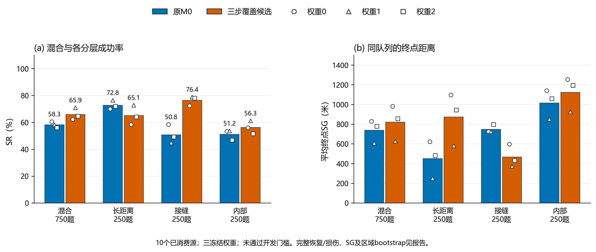

# 三步覆盖接管开发验证报告

2026-10-03。**未通过开发门槛**。本批固定混合队列SR为65.91%，对原M0提高7.64个百分点；SG从738.27米变为821.60米。完整数值与所有未通过项如下，原默认M0保持。

## 离线诊断与选型依据

先只读复核4500条M0 Full/Baseline旧记录、78525动作，没有产生新SR实验。939条Full失败中935条未获得有剩余预算的目标邻接机会，4条获得过但未成功。失败轨迹平均邻接检验机会覆盖为43.49格；覆盖只是几何机会，不代表目标已排除。

视觉线索在原M0配对中恢复498、损伤11条。356次接受但未立即命中，其中226次向真目标靠近、130次远离；首次非邻接线索分歧既见于60条成功恢复，也见于11条损伤，不能据此把所有非命中线索统一删除。未接受cue时方向头的合法方向进度率56.91%、均匀合法方向期望56.30%；这是后验诊断，不能当稳定远距离指引。

选择唯一候选Coverage3：无已接受cue时，每次真实观察枚举三步合法路径，新增邻接检验机会较原探索器首动作可实现的最佳路径至少多2格才接管；同分少重访、优先原动作和固定方向顺序。预算末步只计直接到达；每步重新规划，不提前读取未来图像或领取观察。目标头、原0.50、权重、均值及B20固定。

## 队列与全部结果

同10个已消费区域、750个固定任务，三份训练权重配对，新增2250条候选轨迹；原M0的2250条同题Full只按SHA复用。保留旧test字段供配对，但本批明确为后验开发。每权重混合750题、每层250题；合并后的分母分别2250/750。三个权重不是三个新增独立区域。

| 队列 | M0 SR | 候选SR | SR差 | M0 SG米 | 候选SG米 | M0失败SG米 | 候选失败SG米 |
|---|---:|---:|---:|---:|---:|---:|---:|
| 混合队列 | 58.27% | 65.91% | +7.64点 | 738.27 | 821.60 | 1769.01 | 2410.17 |
| 长距离C12—16 | 72.80% | 65.07% | -7.73点 | 450.80 | 873.60 | 1657.35 | 2500.76 |
| 接缝C8—12 | 50.80% | 76.40% | +25.60点 | 748.40 | 467.20 | 1521.14 | 1979.66 |
| 内部C8—12 | 51.20% | 56.27% | +5.07点 | 1015.60 | 1124.00 | 2081.15 | 2570.12 |

SG为含成功记0的终点曼哈顿距离。失败SG只对失败题求均值；实际移动距离与终点SG分开，见机器汇总。

| 权重 | M0混合SR | 候选混合SR | SR差 |
|---:|---:|---:|---:|
| 0 | 60.53% | 62.27% | +1.73点 |
| 1 | 58.27% | 70.93% | +12.67点 |
| 2 | 56.00% | 64.53% | +8.53点 |

混合SR配对差95%区域bootstrap区间[+5.24, +10.22]个百分点，SG变化区间[+25.86, +131.33]米。4000次、seed7317，三权重先在区域内平均再整组抽取10区域。开发分数、区间及已查看数据均不能代替新源确认。

恢复439条原失败，损伤267条原成功，净增172条成功；所有配对保留，不只展示净增或某个权重。

## 冻结门槛与判定

| 冻结门槛 | 判定 |
|---|---|
| 混合SR至少+2个百分点 | 通过 |
| 至少2/3权重正收益 | 通过 |
| 混合SG不变差 | 未通过 |
| 长距离C12—16 SR损伤不超过2点 | 未通过 |
| 长距离C12—16 SG不变差 | 未通过 |
| 接缝C8—12 SR损伤不超过2点 | 通过 |
| 接缝C8—12 SG不变差 | 通过 |
| 内部C8—12 SR损伤不超过2点 | 通过 |
| 内部C8—12 SG不变差 | 未通过 |

主要验收指标是固定混合SR，但同时保护各分层及SG。保留SR收益和距离代价，未在看到结果后改阈值、改分母或改门槛。主门槛未通过，按运行前协议未启动6750条条件性目标对照，也未下载或消费新的确认区域。

## 验证与范围

- 10项公开信息、cue优先、末步预算、边界、独立规划及分层损伤回归检查通过。最初模块式测试启动没有找到tests包；该次未执行实际测试，失败记录保留，随后按文件发现完成10项测试，两个记录均绑定。
- 离线诊断独立算术复核通过；新主评测2250轨迹/36350动作全部重放，通过原检查点及显式GRU/视觉头方程、独立集合式规划、预算、物理距离、配对和bootstrap核对。算术实现由同一开发会话运行，不冒称另一位人工审阅者。
- 本批0训练、0云端调用、默认保持，无新增地理区域；原S2/S3/S4及上一批空间隔离确认结论保留。Sat2Cap预训练地理覆盖未知；同Massachusetts发布影像，不是异时、跨模态或实飞结论。
- 本候选按单次冻结验证收束。新增因素与新确认须另立协议，现有10区不能再称未消费源。

[运行前协议](执行协议.md) / [判定](验收结论.json) / [主复核](主对照/独立复核.json) / [逐题配对](主对照/逐题配对.json) / [离线诊断](离线诊断/诊断汇总.json)。

图注：同10个已消费空间区域、750个固定任务×3冻结权重的后验开发对照。混合队列及三分层分别展示，每份权重混合750题、每层250题。柱为全部三权重合并值；空心符号为各权重结果，不是置信区间。SG是成功记0的终点曼哈顿距离，米制，较低为好。控制器只改变无已接受cue时的公开几何仲裁；模型、目标头、0.50、输入权限与B20保持。开发门槛按混合增益、分层损伤和SG共同判定，图中SR改善不能独自代表通过，也不是未见区域的独立确认。
