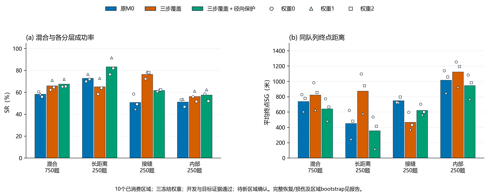

# 覆盖接管径向保护开发验证

2026-10-03。**开发与目标证据通过；待新区域确认**。固定混合SR 67.56%，对M0 +9.29点；默认M0保持。本批为已消费10区的后验开发，未进行新区域确认。

## 诊断与唯一因素

先只读分析M0/Coverage3共4500条旧记录、74189动作并独立计数核验。Coverage3的147条长距离损伤中146条出现过覆盖动作比原探索动作更靠近起点；89条长距离恢复中也有49条出现该信号。全队列10832次接管中的4935次符合信号。它是后验关联，不是错误判别器或因果证明。

唯一候选Coverage3Radial在原Coverage3上添加相对起点径向保护，保留原三步/至少2格规则。保护只否决胜出覆盖动作，不重新选择第二候选；只比较下一格的公开曼哈顿半径。已接受cue优先执行，包括向起点靠近的目标动作；原探索器亦可回缩。控制器五输入不包含真值、距离标签、地区身份或未来图像。原模型、0.50、300米每格、10×10/B20冻结。

## 全部主结果与次要机制对照

同750个固定任务×3权重新增2250条候选轨迹。每权重混合750题、每层250题，合并分母2250/750。主比较对象始终是M0；对Coverage3的改善只作次要机制证据，不替代默认升级门槛。

| 队列 | M0 SR | Coverage3 SR | 径向保护SR | 对M0 SR差 | M0 SG米 | Coverage3 SG米 | 径向保护SG米 |
|---|---:|---:|---:|---:|---:|---:|---:|
| 混合队列 | 58.27% | 65.91% | 67.56% | +9.29点 | 738.27 | 821.60 | 641.47 |
| 长距离C12—16 | 72.80% | 65.07% | 83.33% | +10.53点 | 450.80 | 873.60 | 356.80 |
| 接缝C8—12 | 50.80% | 76.40% | 61.73% | +10.93点 | 748.40 | 467.20 | 622.40 |
| 内部C8—12 | 51.20% | 56.27% | 57.60% | +6.40点 | 1015.60 | 1124.00 | 945.20 |

| 队列 | M0失败SG米 | Coverage3失败SG米 | 径向保护失败SG米 | 径向保护平均有效移动米 |
|---|---:|---:|---:|---:|
| 混合队列 | 1769.01 | 2410.17 | 1977.12 | 4820.40 |
| 长距离C12—16 | 1657.35 | 2500.76 | 2140.80 | 4823.20 |
| 接缝C8—12 | 1521.14 | 1979.66 | 1626.48 | 4809.60 |
| 内部C8—12 | 2081.15 | 2570.12 | 2229.25 | 4828.40 |

失败SG只对失败题求均值；全队列SG成功记0，有效移动距离另报。不得混用SG与移动距离。

相较M0，失败题数从939减为730，但失败题SG从1769.01升为1977.12米。两组失败题集合不同，不能把总体SG下降写成所有失败都更接近目标；条件均值与失败数量一并保留。

| 权重 | 径向保护混合SR | SG米 | 保护否决次数 | 实际覆盖接管次数 |
|---:|---:|---:|---:|---:|
| 0 | 65.20% | 773.60 | 716 | 1157 |
| 1 | 72.00% | 484.80 | 544 | 2493 |
| 2 | 65.47% | 666.00 | 610 | 1808 |

对M0恢复298、损伤89，净增209成功；对原Coverage3恢复234、损伤197，净增37。配对明细全部保留。

混合SR差的10区域配对95%bootstrap区间[+7.91,+10.53]点，SG差区间[-129.74,-64.93]米，4000次/seed7317。每区域先平均三权重再整组抽取，权重不是独立源图。已查看开发队列的区间不构成未见地区泛化证明。

| 队列 | 对M0 SR差95%区域区间 | 对M0 SG差95%区域区间（米） |
|---|---|---|
| 混合队列 | [+7.91,+10.53]点 | [-129.74,-64.93] |
| 长距离C12—16 | [+7.60,+13.47]点 | [-123.20,-65.60] |
| 接缝C8—12 | [+8.53,+13.33]点 | [-174.00,-70.39] |
| 内部C8—12 | [+3.60,+8.94]点 | [-146.00,+11.60] |

内部目标SG变化的区域区间包含0，不能把所有分层的均值改善写成稳定优势。对原Coverage3混合SR差+1.64点，95%区域区间[-0.80,+4.13]点；该次要SR差也未确认稳定为正。正式开发门槛以对M0的预先规定指标判定，不在看到区间后改变。

## 冻结验收与后续

| 冻结门槛 | 判定 |
|---|---|
| 混合SR对M0至少+2点 | 通过 |
| 至少2/3权重正收益 | 通过 |
| 混合SG不变差 | 通过 |
| 长距离C12—16 SR损伤不超过2点 | 通过 |
| 长距离C12—16 SG不变差 | 通过 |
| 接缝C8—12 SR损伤不超过2点 | 通过 |
| 接缝C8—12 SG不变差 | 通过 |
| 内部C8—12 SR损伤不超过2点 | 通过 |
| 内部C8—12 SG不变差 | 通过 |

主门槛通过，已完成6750条条件性目标对照及独立复核，具体证据见目标对照目录。 未在看到结果后更改门槛、分母、保护或默认。开发与目标证据全部通过才能另立新区域确认协议；当前未下载或消费新区域。

| 目标条件 | SR | SG米 | Full SR差 | 区域95% SR差区间 | 全部证据门槛 |
|---|---:|---:|---:|---|---|
| Baseline | 31.56% | 1405.60 | +36.00点 | [+32.84,+39.38]点 | 通过 |
| CueMean | 32.89% | 1239.73 | +34.67点 | [+31.78,+38.04]点 | 通过 |
| CueWrong | 28.09% | 1399.60 | +39.47点 | [+36.18,+43.24]点 | 通过 |

目标对照另复核6750记录/124239动作；和主对照合计9000记录/160392动作。

[下一项新区域确认草案](下一项空间隔离新区域确认草案.md)已保存，尚未准备新图或运行该确认。

## 核验与结论边界

10项行为/权限/预算/独立规划/分层门槛测试通过。新主评测2250记录/36153动作全部以显式神经方程和独立集合式保护重放，并核对终局、物理距离、配对和bootstrap。独立实现由同一会话运行，不冒称另一位人工审核者。旧文件与模型按注册SHA只读核验；0训练、0云端、默认保持。原S2/S3/S4、SwissView及实际区域确认判定有效。

本批仍为Massachusetts发布航拍影像上的本地切图仿真；Sat2Cap预训练地理范围未知，不支持异时、任意角度、跨模态或实飞结论。现有14区域已消费，不能再称新区域确认。

[冻结协议](执行协议.md) / [判定](验收结论.json) / [主复核](主对照/独立复核.json) / [机制对照](主对照/Coverage3机制对照汇总.json) / [诊断复核](离线诊断/独立算术复核.json)。

图注：同10个已消费区域、750题×3冻结权重的后验开发。每份权重混合750题、各层250题，柱为合并均值，空心标记为各权重，不是置信区间。原M0及Coverage3按封存哈希复用，仅新增Coverage3Radial。唯一新增因素为无已接受cue时保护相对原探索动作的起点径向延伸，已接受cue始终优先。SG为成功记0的终点曼哈顿距离；不是路径长度。开发证据不替代新区域确认。
