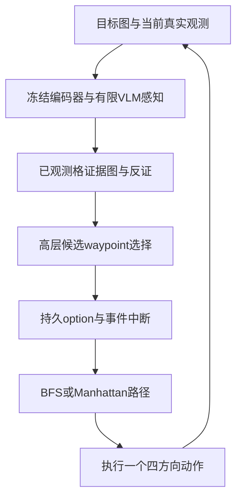

# 主动视觉地理定位：从逐步动作排序到目标证据驱动的搜索规划

> 调研截止：2026-09-30（Asia/Shanghai）｜深度：deep｜主报告47项去重研究来源，证据包另含补充文献｜目标：给定图片，在未知网格中主动找到对应地点｜本次产出为研究与实验设计。

## 1. Executive Summary [High：架构依据；Low：本项目收益预测]

当前最值得推进的是**目标实例证据记忆 → 持久 waypoint/option → 预算内规划 → 确定性逐格执行**。先让高层回答“应去哪个可达位置验证哪条目标线索”，再由程序执行路径；高层在子目标完成、证据被反驳或强目标线索出现时重规划。这样既超出 visited set 与简单粗区域排序，也能分别检验感知、记忆和规划的作用。InstanceImageNav 的模块化匹配定位、TSGM 的跨节点记忆、HRNav 的高低层分工、SPF 的 waypoint 接口和 SemNav 的非贪心规划提供了不同部分的依据。[14], [16], [6], [19], [18]

三篇起点论文并不构成 training-free 方法：GOMAA-Geo 对齐多模态表示并训练历史编码和 PPO；GeoExplorer 增加动作条件下一观测预测及好奇心；DynCur-Geo 主要改训练期好奇心权重和潜势奖励。它们可作为任务与学习基线，但不是唯一可选技术路线。“未见地图零样本泛化”和“无需任务训练”必须分开。[1], [2], [3]

本次本地核验比附件中的进度更进一步：已有 BC/PBRS/好奇心、目标遮蔽与小头实验，最新还有边缘连续性线索候选。因此不能把这些重新当作新建议。当前强开发默认是 NoTarget 探索器；Edge 的同源切片开发收益尚不能证明跨采集语义定位。现有 val 只有4张源图，100题不等于100个独立地区。[本地边界核验](D:/桌面/XDUCS-courses/大四/大数据工程/调研/04_local_project_context.md)

最应先解决的研究问题是：**目标图究竟提供了什么可利用的空间证据，怎样在多步搜索中保留并消耗这些证据？** 只提高覆盖率或只避免循环不能回答它。推荐先明确现有目标线索的有效范围，再试持久子目标、实例关系记忆、同分数短路径搜索和轻量跨步关系 scorer。世界模型、大规模端到端 RL 与多无人机暂放后续；本机8GB GPU、25格确定性几何并不要求先训练完整世界或导航基础模型。这是资源与任务条件下的设计判断，不是这些方法普遍无效。

## 2. 当前领域技术图谱 [High]

### 2.1 三个相关性层级

| 层级 | 代表研究 | 可迁移内容 | 必须保留的任务差异 |
|---|---|---|---|
| Level 1：直接相关 | AiRLoc、GOMAA-Geo、GeoExplorer、DynCur-Geo [4], [1], [2], [3] | 当前航片+目标cue+动作历史；有限预算四邻格搜索 | 环境有整幅数据及训练目标坐标，策略只见局部；不是被动经纬度回归 |
| Level 2：高度可迁移 | Modular InstanceImageNav、IEVE、TSGM、UniGoal、HRNav、SPF [14], [15], [16], [17], [6], [19] | 实例匹配、目标定位状态、子目标、视觉记忆、独立执行层 | 室内深度/视角、远距目标可见、STOP和碰撞协议往往不同 |
| Level 3：跨领域思想 | belief搜索、模型不确定性、LSP、world model、协同探索 | 假设维护、观测选择、路径效用、经验检索、联合任务分配 | 需要明确观测模型/未来预测数据，不能凭空获得未访问图像 |

ImageNav、InstanceImageNav、ObjectNav 和 VLN 不能混写。ImageNav可要求到达图片拍摄位姿；InstanceImageNav可要求接近图片中的同一对象实例；ObjectNav常允许任意同类对象；VLN的目标由语言路线描述指定。当前系统是**航拍目标地点实例的预算搜索**：目标是一张patch，成功是到达指定格，不是找到任意“房屋”，也不是恢复6DoF相机位姿。[13], [14], [7], [9]

### 2.2 更贴合当前项目的形式化

已知当前位置 `x_t`、网格边界与四方向转移；未知目标格 `G` 与未观察视觉地图 `M`。历史 `h_t=(goal_image,o_0,a_0,...,o_t)`；策略目标是 `P(τ_G≤B | h_t)`，其中 `τ_G` 是首次命中时间。可建模为目标条件部分可观测搜索；GOMAA-Geo已经采用GC-POMDP描述，但其求解器是训练策略。[1]

本项目的设计推断：belief主要对**目标位置和地图视觉假设**建模，不能把“自身位姿不明”的定位算法原样移植。网格内自身坐标已经公开；额外SLAM、占据栅格重建和视觉里程计不是当前首要缺口。物理几何网格已知也不等于目标地图已知：BFS知道怎么去某格，仍不知道哪格值得去。

若两个未知地图对已访问格提供完全相同画面与目标图片，但未访问目标分别在相反方向，Agent输入历史相同，无法保证对两图都选择正确方向。这是本报告的构造性推论。因此远目标方向需要连续道路/水系、布局关系、轨迹几何、已学习先验等额外关联；缺少关联时，正确行为是有预算的探索与弃权，不是用解释性文本制造确定方向。

### 2.3 当前协议中的特殊点

直接读取本地环境确认：只有当前图与目标图，不能查看四邻格；5×5、B=10；动作实际为 `up/right/down/left`；越界原地耗一步；预算内第一次到达即终止成功，无STOP。因而“在目标处继续核验”没有决策机会，确认模块若有用，必须在到达之前改善方向/目标假设。室内方法常能在远处看到目标，本网格不能假设这一点；GOMAA论文也明确指出这种任务差别。[1] 本地SG是全部episode终点曼哈顿距离平均，不是SPL，也不应混用文献不同SG口径。[本地协议](D:/桌面/XDUCS-courses/大四/大数据工程/调研/04_local_project_context.md)

## 3. GOMAA-Geo / GeoExplorer / DynCur-Geo 对比 [High：前两篇；Medium：预印本]

| 维度 | GOMAA-Geo [1] | GeoExplorer [2] | DynCur-Geo [3] |
|---|---|---|---|
| 年份/venue | NeurIPS 2024 | ICCV 2025 | 2026-08 arXiv；未核实正式接收 |
| observation | 当前aerial patch、目标cue、动作/观测历史、格位编码 | 沿用局部多模态AGL观测与历史 | 沿用GeoExplorer观测；推理不输入真目标距离 |
| state/记忆 | 因果LLM历史表示+位置 | 因果序列历史与环境预测表示 | 冻结历史/动力学编码，策略状态仍历史化 |
| next move | PPO actor-critic选四邻方向 | PPO actor-critic选四邻方向 | PPO actor-critic选四邻方向；合法动作条件需对齐 |
| LLM/VLM角色 | Falcon历史编码；CLIP/Sat2Cap表示对齐 | 历史编码与下一patch特征预测 | 使用已预训练的历史/动力学编码器 |
| 训练 | 跨模态对齐、监督历史预训练、PPO | 动作监督+动作条件下一特征预测，随后PPO | 冻结序列模型后训练奖励改造的PPO |
| 显式地图/传统search | 无显式语义地图或外部图搜索 | 无外部地图规划器 | 无外部图搜索规划器 |
| exploration/exploitation | 历史策略与目标距离进展监督/奖励 | 外部进展奖励+预测误差好奇心 | 好奇心随训练目标距离衰减，另加PBRS |
| coarse-to-fine | 不是显式持久waypoint体系 | 不是外部global/local规划 | 奖励调度不是层级区域搜索 |
| 可复用算法思想 | 目标条件的完整历史表示 | 动作条件预测作为训练探索信号 | 目标导向与新奇探索的训练期动态平衡 |

结果必须带协议。两篇前作的Masa分距离结果、DynCur的MM-GAG结果和不同B的统一评测不能混成总排行榜。例如DynCur的5×5、B=10、MM-GAG航空目标在C=4并非优于前作，C=6–8则更强；其更长初始距离结果可能受任务配置/边界与目标分布影响，不能简单解读为“越远越容易”。[2], [3] 本地源图划分与论文口径不同，报告不计算“本地分数减论文分数”的提升。

开源也有层次：GOMAA官方仓库可读代码但权重区仍标Coming Soon；GeoExplorer实现已公开、权重状态未完全核实；DynCur未找到可确认的官方仓库。代码存在不等于checkpoint、预处理和评测协议均可复现。[1], [2], [3] 详细作者、链接、数据与证据位置见[起点论文卡](D:/桌面/XDUCS-courses/大四/大数据工程/调研/01_direct_geolocation_sources.md)。

三篇论文的训练数据也不应混写：GOMAA/GeoExplorer以Masa构造航拍搜索训练，MM-GAG、xBD等用于多模态/跨域评测；DynCur原文最终训练池是137张Masa加47张MM-GAG，PPO为480k环境步。[1], [2], [3] 训练样本是动态采样episode，不是同等数量独立地图；多模态训练池和本地仅Masa不能作为算法单变量对照。

对当前项目：完整重训GOMAA并非首选；其LLM隐式历史可以用结构化证据图/小记忆头作为低成本对照。GeoExplorer/DynCur的好奇心和PBRS本地已有尝试，不能作为新的主方案重复提出。真目标距离可用于隔离的训练奖励，但不能在推理期拿来决定探索权重；training-free路线要用可观测证据强度或明确的启发式代替，不能声称等价复现。

## 4. 直接相关研究 [Medium–High]

AiRLoc是必要前驱：同场景目标航片、局部四向移动、位置与历史，近目标匹配先验与探索策略分工。[4] 可复用的是“局部有可靠目标关系时利用，否则继续覆盖”的结构；项目已有类似线索头，新的研究应放在证据如何累计、介入何种子目标，而不是再次增加邻接分类。

HRNav（ACL 2026）把图像目标任务拆成VLM短期计划和RL执行：高层按较长间隔给子任务，低层持续执行。它支持持久高层计划的可行性，却**训练了高层VLM和低层RL**，不能归入免任务训练；本项目拟以冻结VLM和BFS替换这些组件，是迁移设计，不是其原始实现。[6]

2025–2026的IGL-Nav与AnyImageNav把目标图当作定位查询，强调先粗定位再细几何匹配；后者按语义相关性触发昂贵的几何注册。[7], [9] 对当前航拍patch最有价值的是感知预算分配：廉价描述子持续筛选，昂贵实例/结构匹配仅在有根据的候选出现时调用。不要原样搬3D Gaussian、RGB-D与6DoF优化，也不要重复已失败的“high证据就回退一次”。

SIGN面向无人机图像目标与连续控制/安全；LSVL要求事先地理配准的参考卫星地图；两者应用背景相关，但前者主要补未来连续执行，后者的信息权限改变了未知网格任务。[5], [12] 离线ImageNav的新预印本则提供随机探索轨迹、goal重标注和小型离线策略思路，仍需要明确数据与离线学习，不是即插即用的training-free结果。[8]

直接论文没有给出“一个最好的training-free未知航拍网格Agent”。这项空缺允许做结构迁移实验，但并不能据此宣称本项目已经具有新颖性；还要核查更广的实例匹配、主动搜索和规划文献。

## 5. Embodied / Navigation 可迁移研究 [High]

最应优先读Modular InstanceImageNav、TSGM、UniGoal与UAV跨图记忆预印本。Modular InstanceImageNav将实例重识别、目标位置估计和路径执行分开；TSGM保存图像与语义节点并检索目标相关上下文；UniGoal让目标图与在线场景图逐步匹配；2026四旋翼工作以对象/观测记忆、候选视点和独立轨迹执行实现分层。[14], [16], [17], [20]

这些模块迁移到网格后的具体形态不是室内room graph，而是：每个见过的格保存视觉实例特征；边记录真实动作连接；目标图生成有来源的结构关系查询；候选未见格只有位置与假设标签，不能出现未取得的图像描述。道路出口、河流走向和建筑布局可作关系特征，但是否具有远程目标信息必须单独测，不能用“同是房屋”替代实例匹配。

IEVE的探索—验证—利用状态机比一次target evidence枚举更成熟，但其多视角/对象可见性收益并不自动适用于只能看当前patch、命中即结束的系统。[15] 迁移时改为候选假设的支持与反证累计；重复读静态同一图不是新证据，只有不同位置/不同可验证关系才增加信息。

PONI说明小型空间潜势scorer可以把“去哪”与“怎么走”分开，降低大策略训练需求；它预测对象类别的潜势，若用于本项目，需要改成目标图条件的候选空间评分并重新验证。[29] Active Neural SLAM与SemExp则是global/local分工和持续空间状态的经典基础，而非要求本项目重新学习位姿与障碍。[30], [31]

迁移风险按三类报告：感知权限是否更丰富（RGB-D、远处目标可见）；目标是否不同（类别/实例/相机位姿）；代价是否不同（500步或连续控制与10步四向格子）。只要一项变化，论文分数就不能作为本项目预期收益。

## 6. VLM Agent 研究 [High：存在架构证据；Low：本任务优劣排序]

| 架构 | 一手证据 | 对本项目的意义 | 证据不能支持的结论 |
|---|---|---|---|
| VLM直接选择受限动作 | VLMnav [22] | 用传统候选生成器约束空间输出，可保留强动作基线 | “直接动作必然无效” |
| VLM给地图/候选分数 | VLFM、SG-Nav、SemNav [24], [25], [18] | 把语义评分缓存成外部状态，独立比较planner | “所有zero-shot方法不用训练组件” |
| VLM输出waypoint并交执行器 | SPF、HRNav [19], [6] | 显式子目标和执行承诺；适合测试高层调用降频 | “已证明优于当前四方向ranking” |
| 统一历史基础模型输出轨迹 | NavFoM [21] | 输出可以是轨迹/候选而非单动作，历史需要预算 | “8GB机器适合从头训练完整NavFoM” |

SPF的同任务消融提供动作接口对照；SemNav提供同高层评分下的greedy/LSP对照，两者证明应开展相应实验，却不构成当前网格的相同协议比较。[19], [18] 特别是SemNav原文低层采用在HM3D训练的预训练PointNav policy；VLFM也利用预训练导航组件。拟采用BFS，是利用当前几何简单性的替换，不应误写为这些方法原本就是纯确定性无训练控制。

建议VLM初次输入包括目标图、当前图、少量检索到的历史证据和只含公开信息的候选网格；输出仅为合法候选 `waypoint_id`、`evidence_ids`、`option_horizon`、`abstain`。它不需要生成自然语言飞行指令。高层选目的地后程序求路径并逐步执行；每步新图仍用于更新状态，降调用频率不等于停止感知。模型自报confidence暂只记日志，若参与概率或门控必须校准。

“视觉chain-of-thought更长”没有在本任务被证实能改善导航；更多tokens也可能只是更昂贵的方向猜测。比较有依据的实例对应/关系约束与直接评分，固定调用和输入预算，比单纯增加推理文本更能解释收益。跨模型比较也要固定任务和协议，不把服务模式/解析差异当作纯参数量因素。

2025 Select2Plan补充一条training-free路线：结构化VQA加示例检索/ICL，使用视觉样例库而非更新policy参数。[47] 可迁移为从训练源图经验中检索“此类目标关系下该option的结果”，然后约束当前候选选择；不是重复四方向ranking。它仍需要示例数据，并且其语言/物体目标、FPV/TPV视觉接口不同，原文增幅不能用于预测本项目。

## 7. Memory 方法 [High：机制；Low–Medium：航拍迁移]

| 类型 | 代表 | 可直接实现的替换 | 训练与权限 |
|---|---|---|---|
| metric/semantic map | SemExp、VLFM [31], [24] | 已观测格的目标相关value与特征，不仅visited | 原版感知/导航有学习组件；grid版本可先规则化 |
| topological memory | TSGM、quadrotor跨图 [16], [20] | 图像节点、真实转移边、跨节点实例关系 | 原版策略训练；本地图构建无需训练 |
| episodic visual memory | TSGM、GOAT-Bench [16], [23] | 目标相关历史图/描述子检索，保留空间来源 | 同episode可以training-free；跨episode另立协议 |
| retrieval/experience | Memoir、HM-Nav [27], [28] | 检索哪条证据有效，以及该option曾怎样失败 | 原系统更重；本地可先做哈希/近邻与失败表 |
| recurrent/transformer | GOMAA、GeoExplorer、NavFoM [1], [2], [21] | 小GRU/attention融合历史节点作scorer | 需要训练，hidden state必须跨步持续 |

推荐的最小记忆记录：`(cell, image_hash, descriptor, target_relation, counter_evidence, provenance, quality, option_outcome)`。它解决三个具体问题：过去看过的视觉内容不再丢失；同一目标假设可以被多个位置支持或反驳；路径失败可归因于证据错误、控制错误或预算不足。visited仍保留，但它只是覆盖字段。

目标相关检索不能只返回最像目标的全部历史：加一个空间邻接证据和一个反例，有助于避免自我强化。不要把经过多次相同静态图的同一分数当作多份独立支持。原始像素或描述子保留用于追溯；VLM摘要可能把实例布局压成“住宅区”，这种信息损失应通过原图历史/FIFO/结构记忆消融检验。

经验检索的单位可以是短option：输入线索与历史关系，检索相似条件下的成功/失败子路径；不能通过相同val地图的跨episode缓存间接记住答案。GOAT-Bench的lifelong设定有价值，但本项目默认episode清空；持续记忆必须新协议、独立数据并报告冷启动和热启动。[23]

2026-07的VTM-Nav明确研究跨episode的层级视觉拓扑记忆：以房间索引视觉记录，将记忆作为软先验，只重排当前观察生成的候选。[45] 其匹配40-step对照有正收益，但目标为类别、RGB-D候选和场景复用都与本项目不同。最值得借的是“历史建议不能越过当下合法接口”和来源/置信/失败记录；跨episode持久化本身仍属于后续单独协议，不能偷偷加入本轮。

FTM把未访问但可见frontier表示成ghost节点，并学习其特征。[32] 当前grid已知候选位置，却没有邻格图像，因而只能借“未知候选也有显式状态”的思想，不能把预测特征标为观察。候选node的 `observed=false` 与证据来源应始终保留。

## 8. Hierarchical Planning 方法 [High]

成熟层级设计至少有三种层次：global policy选择长期目的地、local policy执行；高层生成语义子任务、低层conditioned policy执行；显式候选节点与路径代价规划、局部控制执行。ANS/TSGM、HRNav与SemNav/UAV视点规划分别覆盖这些分工。[30], [16], [6], [18], [20]

当前“粗区域ranking→一步方向”每步都可能重新改口，未必有完整子目标状态、到达条件、预算和中断规则。因此新增的应是一个**具有开始、保持、终止条件的option**。最小option状态为 `(waypoint, evidence_ids, start_step, max_duration, termination_reason)`；正常到达、证据反驳、强匹配出现、预算不可达和固定超时分别触发重规划。预计高层有效调用减少是待测结果，不保证导航必然提高。

粗区域应作为提案而不是最终答案：高层先给2–3个候选区域/节点，程序按可达性、剩余步数、预期线索和覆盖成本选择具体waypoint。对5×5无障碍几何，BFS即可；没有必要为了算法名字加入A*、复杂连续控制器或图神经网络。候选可以跨未见格，但途中每格都要真实执行并获取观测；不能把一次waypoint跳转算成一个动作。

进一步的层级是“找证据→检验假设→接近目标”的任务层级。例如目标图呈现河流旁道路转折，先观察能区分两种水系延续假设的邻接路线，再根据真实新画面决定利用。该方案依赖目标关系可识别；如果关系不可验证，option退回覆盖搜索，而不是强行生成语义子任务。此处是本报告提出的网格适配，不是原论文已证实的航拍算法。

## 9. Active Perception / Information Gain [High：成立条件；Low：当前收益]

### 9.1 从“像不像目标”转向“能够验证什么”

设 `b_t(c)=P(G=c|h_t)`。贝叶斯更新需要 prior 与 observation likelihood，不只是把VLM的四方向分数softmax：

`b_{t+1}(c) ∝ p(o_{t+1}|G=c,h_t,a_t) b_t(c)`。

严格目标信息增益是 `IG(a)=H(b_t)-E_o[H(b_{t+1})]`，期望需未来观测分布。POMDP对象搜索的GPOMCP提供在线belief-tree的实际例子，但其家具/点云、目标物体和遮挡观测模型均比当前网格更丰富。[38] MAX通过动作条件forward ensemble的未来分歧引导探索，度量的是模型相对新奇性，不等于目标格概率；Semantic Curiosity则将探索反馈对齐检测器学习，说明“有信息”还必须问对哪个任务有信息。[35], [36]

本项目宜先将数值叫作 `target_score` 与 `evidence_quality`。没有可验证的似然时，用多假设可检验性或预测分歧作proxy，明确不称其为贝叶斯最优策略。模型自报“0.9”、cosine、选择频率、token概率和位置概率各有不同含义；不能直接互换。

### 9.2 哪些条件下信息增益不会超出覆盖探索

本报告推导：若目标均匀分布于n个未访问格，任一新格只提供命中/未命中，且没有空间相关线索，则其期望后验熵均为 `(1-1/n)log(n-1)`，每个新格的IG相同。此时挑“高IG方向”只是选择更省路的新覆盖。visited规则和预算内覆盖是合理基线，不能将它们换一个entropy名字宣称新方法。

真正可能额外有用的情况是：某位置可观察道路是否继续、河流方向、地物布局是否支持目标关系；不同假设对该观察作不同预测。先生成2–4个有来源的假设，例如“目标沿已见道路北延”与“目标在另一条平行道路”，选择能够检验它们的waypoint；观察后保留或拒绝假设。如果没有验证点或预测都一样，模型应弃权。

### 9.3 轻量概率模型的注意事项

从判别器得到 `P(match|features)` 不等于生成似然 `p(features|G=c)`；直接反复相乘会重复使用训练prior。可以先训练一次融合的候选scorer并在按源图隔离的校准集上转换分数，再明确其覆盖范围；未见格仍保留prior，不能仅对visited节点归一化成总概率1。静态同一图片的重复观察不提供独立证据，应去重或联合建模。

在当前模拟器，活着离开一格确实意味着该格不是目标；这是自动成功协议的反馈。真实无人机无此反馈，需要误识别/漏检与停步建模，因此不能把visited目标概率严格置零的规则原样部署。建议以可靠性图、Brier、risk-coverage及目标贡献验证概率模型，先证明收益，再研究更完整POMDP。

## 10. Search / Planning [High：已有机制；Medium：工程适配]

2026-09的AeroBelief是新的航拍邻域证据：将宽松上下文intuition与严格目标evidence分层，并将覆盖引导与语义热点分开，加入时间承诺。[46] 它支持本报告分离覆盖器/目标线索的结构思想；但目标是语言物体、AirSim状态更丰富，task-training-free声明未完全核实，源码截至检索日尚待发布，不能记为可直接复现的图像目标Agent。

### 10.1 首先区分路线代价和目标启发值

当前无障碍固定网格上，BFS/Manhattan提供准确的到指定waypoint代价；A*只改善找到路径的计算，不会从目标图推导目标位置。frontier原法用于未知空间边界建图，本网格已知几何，其合理类比是未观察视觉内容的候选边界，而非新增障碍信息。[33] 因而新贡献应在候选效用、证据与预算分配，而不是换搜索算法名字。

SemNav的LSP把候选frontier成功概率、到达代价、失败后探索/返回代价放入非贪心规划；同论文相同评分下SPL=35.9对greedy34.3，SR=54.9对54.6，只能说明其室内ObjectNav设置的路径效率差异。[18] 本项目可以保留“失败代价也要考虑”的思想，将其替换为剩余动作预算和能看到多少目标相关证据，而不是照搬室内距离常数。

### 10.2 推荐的预算内短路径规划

给定候选路径 `P=(c_1,...,c_h)`，先用非概率效用：

`J(P)=Σ_j γ^(j-1)s_target(c_j)+βE_new(P)-λL(P)-μR(P)-ρU_bad(P)`。

这里目标分数来自已观测实例线索/明确prior；`E_new` 是新证据或新覆盖proxy；`L` 为真实逐格路程；`R` 为重复证据，不能简单禁回退；`U_bad`惩罚不可靠预测。所有系数属于本项目设计，需同源图隔离开发选择，不能借用论文数字当最佳值。每轮只执行首步，再用真实新图更新。

若拥有单一静态目标的校准格概率、路径在执行前固定且不利用中途新信息，则预算内命中概率是路径访问唯一格集合的概率质量之和 `Σ_{c∈unique(P)}b_t(c)`；同一格不重复加分。想最小化首次命中时间，还需按序考虑存活概率和前缀成本。这两种目标不同，不能用随意相加的score声称精确求解POMDP。

建议先测h=1/2/3/4及固定beam宽；25格状态让小规模枚举可行。MCTS需要可模拟的未来观测分支，若rollout只是虚构未见图像，增加搜索次数只会放大错误先验。[38] 有可靠动作条件模型后再比较MCTS/CEM，先用相同scorer、相同VLM调用的beam对照识别规划收益。

### 10.3 两类实用搜索基线

“只追最高语义分数”的best-first可能被相似非目标地物吸引；“只追未访问”可能绕开已见的目标方向线索。需要同时提供budgeted coverage规划和goal-conditioned规划：前者优化新格覆盖/路程，后者额外消耗目标实例证据。若后者与前者效果相同，新增高层可能只是更聪明的覆盖器；这是可解释结论，并不一定是失败的工程结果。

## 11. RL / Imitation Learning [High：方法事实；Low：最优训练量]

| 方法 | 在当前系统的角色 | 训练数据/成本 | 主要限制 |
|---|---|---|---|
| PPO/actor-critic | 任务同构学习基线；可训练option/scorer | 在线episode、训练真值奖励；跨源图评测 | 方差、地图先验过拟合、视觉目标被忽略 [1], [2], [3] |
| DQN | 小动作空间的可比较基线 | replay与探索；历史需显式编码 | 隐状态不是标准Markov输入；没有证据证明优于PPO |
| BC | 可作小高层/关系选择基线 | 专家轨迹/合法oracle标签仅训练用 | 学自己不遇见的专家状态，闭环误差累积 [34] |
| DAgger | 在闭环访问分布补标小policy | 需要可用teacher及额外交互 | teacher必须可获得且不混入测试真值 [34] |
| HER+offline RL | 复用随机游走和已访问目标重标注 | 历史视觉轨迹、离线优化 | 数据支持与OPE选择；尚无本grid已验证优势 [8] |
| hierarchical IL/RL | 训练高层option selector，不训练完整VLM | 目标条件历史及子目标标注 | 分层不是免费，需明确teacher与行为协议 [6], [16] |

当前已有BC/PBRS/curiosity，因此“换PPO”“再加好奇心”仅能作基线或严格单因素对照。首选轻训练对象是视觉关系/候选scorer、证据融合或option选择，而不是把8GB机器用于完整7B历史LLM或大导航基础模型训练。NavFoM的跨平台大样本训练提供规模背景，不能被用来估算本项目的小头训练效果。[21]

需要多少数据没有可直接搬用的统一答案。源图数量、地理独立性比重复episode数更关键。建议事前冻结训练源图规模阶梯（例如20/50/87张作为资源试验点，是否适用取决于现划分），同一独立开发集评估，记录unique源图、unique目标、轨迹长度、更新步与sample reuse。不要说几百万重复样本就是几百万独立地理观测；也不要承诺固定小时数，需测吞吐与显存。

真目标坐标仅用于训练标签不等于泄漏，但最短路teacher会在远处无可识别线索时给出策略无法从输入推导的方向。BC可能因此学数据分布偏置，而非地理视觉关系。更合理的teacher包括合法覆盖/信息采集策略与有证据时的目标匹配干预；oracle最短路可作上界或明确的特权训练对照，不作training-freeAgent输入。

跨地图泛化需按原始源图、地区、拍摄时间隔离；同源crop随机split很容易过于乐观。Monaci的ImageNav仿真shortcut结果提醒，终端成功分数可能由视觉以外的配置带来。[11] 目标隐藏、错误目标、位置/历史打乱、NoTarget从头训练与同权重遮蔽应分别解释；当前强NoTarget默认要求新学习策略给出额外目标贡献。

## 12. Training-free / Zero-shot [High：边界；Medium：兼容性]

“task-training-free”在本报告指不针对当前地图或目标搜索任务训练policy/scorer。使用已有模型权重是允许的，但其训练来源需记录；训练新的校准头属于light training。论文说zero-shot可能只指未见物体/场景、目标模态迁移或高层不用训练，不能直接当作完整系统无导航训练。[1], [18], [24]

对当前协议最兼容的是冻结视觉模型+实例/关系评分+observed-only记忆+网格planner。Modular InstanceImageNav和AnyImageNav支持用现成视觉匹配组件构成系统；SPF支持冻结VLM的空间输出接口。[14], [9], [19] 迁移时保留匹配/选择功能，取消不必要的RGB-D、3D重建和连续运动组件。task-free路线也要报告VLM成本和感知模型依赖，不能用“不训练”掩盖每步多次昂贵API调用。

推荐最小版：目标descriptor缓存一次；每次真实观测只更新一个节点；高层读取有限历史及候选waypoint；确定性路径每步执行；有强实例线索中断当前option。完整版加入目标关系图、反证、候选分歧与budgeted beam，但逐个证明其贡献。若无相关线索，回到固定覆盖策略，让语义模型可弃权，比每步强制输出方向更可诊断。

## 13. Multi-Agent [Medium：可迁移机制；Low：本任务联合收益]

多机稀疏信号active search与多无人机搜索/监控已有不同一手建模：前者研究分散采样，后者用semi-Dec-POMDP及任务分配。[43], [44] 它们与目标图实例匹配不同，本轮单Agent主线不能被通信/调度盖过。

将来建议共享最小消息 `(cell,evidence_type,score,quality,source_id,version,agent_id)`，而非默认广播全部图像；同图证据用hash去重，推断与观测严格分开。中央协调器可以按候选区域收益/到达成本分配任务；分散式可以维护本地图并周期交换摘要，需处理证据延迟和冲突。避免重复搜索不仅是共享visited，更要共享已排除/待验证假设与option执行状态。

评测至少有两个预算：总动作 `Σ_i steps_i` 与wall-clock/makespan；两个Agent各10步相对单Agent10步天然多一倍探索，不能直接归因协作。按总动作相等比较，再按实际并行时间比较；另报通信bytes、消息数、冗余观测和断网退化。未知“多个agent”也应与固定分区规则比较。当前探索器与目标头是一个Agent内的模块，不称为多Agent。

## 14. 15个候选方案池 [Low：收益与新颖性待实验；设计评估]

成本以当前25格、B10、8GB机器为参照；API低/中/高是相对每步VLM基线，金额未知。泛化与新颖性是条件性判断，不保证论文贡献。

| 方法 | 核心思想/来源 | 训练要求 | 改造/计算/API成本 | 数据需求 | 泛化潜力 | 风险 | 兼容性 |
|---|---|---|---|---|---|---|---|
| C01 持久waypoint+事件重规划 | 高层子目标承诺，BFS执行；HRNav/SPF/ANS [6], [19], [30] | training-free适配 | 低–中/低/低 | 无新增task训练；固定开发题 | 中 | 错误子目标持续执行、短预算漏线索 | 高 |
| C02 实例关系证据图 | 目标与已见节点关系匹配；UniGoal/TSGM [17], [16] | training-free最小版 | 中/低–中/中 | 已观测图；目标结构需验证 | 中–高 | 类别摘要丢实例，VLM关系幻觉 | 高 |
| C03 目标相关episodic检索 | top-k历史视觉+反证+来源；TSGM/GOAT [16], [23] | training-free | 中/低/中 | episode内历史；跨episode另协议 | 中 | token增长、相同证据重复计入 | 高 |
| C04 多尺度图像目标定位状态 | global descriptor+细粒度对应级联；FGPrompt/AnyImageNav/IGL [37], [9], [7] | 冻结版free；adapter轻训 | 中/中/低 | 现成模型；新视角评测对 | 中–高 | 同源seam捷径，纹理重复 | 高 |
| C05 可检验多假设主动观察 | 选可区分目标关系假设的点；MAX/GPOMCP类比 [35], [38] | free proxy | 中/低–中/中 | 不需task训练但需可靠假设 | 中 | 分歧无根据；proxy并非IG | 中–高 |
| C06 校准候选belief融合 | prior+目标证据+反证去重；GPOMCP/LSVL [38], [12] | light training/calibration | 中/低/低 | 源图隔离匹配/错配与自然比例校准 | 中 | 似然错用、未见格概率丢失 | 高 |
| C07 同分数budgeted beam | 2–4步候选路径，首步重规划；SemNav/LSP [18] | training-free | 中/低/低 | 复用现有scorer | 中 | 启发值误差被lookahead放大 | 高 |
| C08 budgeted coverage/orienteering | 最大新格覆盖/路程；frontier/ANS基础 [33], [30] | training-free | 低–中/低/零 | 无视觉训练 | 中 | 成功高却无目标视觉贡献 | 高；强探索基线 |
| C09 多专家证据与弃权 | 现有Edge+细粒度matching+关系可靠性 | light calibration；冻结专家可free | 中/中/低–中 | 跨视角、相似错目标、校准图 | 中–高 | 专家相关、投票过度自信；Edge不是新贡献 | 高 |
| C10 短option经验检索 | 检索相似证据下成功/失败子轨迹；Memoir/HM-Nav [27], [28] | free检索或light scorer | 中/低–中/低 | 仅训练源图经验；冷启动评测 | 中 | 同地图答案记忆、分布不匹配 | 中 |
| C11 跨步关系小scorer | 当前+目标+2–4历史节点；TSGM/MemoNav [16], [39] | light training | 中/低–中/低 | 独立源图关系/候选标签 | 中–高 | 图特征仍不足；过拟合源图 | 高 |
| C12 hierarchical IL/options | 只学高层子目标选择；HRNav/DAgger [6], [34] | light–moderate | 中–高/中/低 | teacher+闭环option轨迹 | 中 | oracle动作不可识别、分布偏移 | 高 |
| C13 goal-conditioned recurrent RL | 目标历史策略；GOMAA/GeoExplorer [1], [2] | heavy相对free；小头版可轻 | 高/中–高/低 | 在线episode与训练奖励、至少多源图 | 中 | 探索prior压过目标，训练种子波动 | 高；学习基线 |
| C14 latent world model+MPC | 动作条件视觉预测并规划；NWM/NavWAM [40], [42], [10] | heavy training | 高/高/可低但本地计算高 | 连续动作—观测数据/先验 | 未知 | 生成未见真图不可识别、数据域外 | 中；暂缓 |
| C15 多Agent共享证据分工 | 中央/分散任务分配；多机active search [43], [44] | 可free调度；学习版重 | 高/中/随Agent数增 | 多机episode、通信协议 | 未知 | 总预算不公平、通信延迟/冲突 | 低；后续 |

| ID | Research Value | Engineering Difficulty | Training Requirement | Novelty Potential（需验证） |
|---|---|---|---|---|
| C01 | 高 | 低–中 | training-free | 中：option承诺/证据触发，不能仅改输出格式 |
| C02 | 高 | 中 | training-free最小版 | 中–高：实例关系与跨步反证支持导航 |
| C03 | 中–高 | 中 | training-free | 中：检索策略与空间来源需有独立收益 |
| C04 | 高 | 中 | free/light | 中：跨视角实例表征或budgeted cascade |
| C05 | 高 | 中 | free proxy / light model | 中–高：必须证明目标信息而非novelty |
| C06 | 高 | 中 | light training | 中：校准本身通常不足，需决策贡献 |
| C07 | 高 | 中 | training-free | 中：目标效用与预算约束有明确作用 |
| C08 | 中（基线价值高） | 低–中 | training-free | 低：单纯覆盖不是视觉定位贡献 |
| C09 | 中–高 | 中 | light calibration | 中：不能将已有Edge重新包装 |
| C10 | 中 | 中 | free/light | 中：独立地图与冷启动结果必要 |
| C11 | 高 | 中 | light training | 中–高：跨步关系收益比模型变大更明确 |
| C12 | 中–高 | 中–高 | light/moderate | 中：需teacher设计与闭环对照 |
| C13 | 中 | 高 | learning-based | 低–中：直接复现/改奖励通常有限 |
| C14 | 中（未来高） | 高 | heavy training | 高潜力、当前证据不足 |
| C15 | 中（后续） | 高 | free–heavy | 中–高，但必须独立通信/预算贡献 |

这里没有把visited set、简单防重复和单次coarse region ranking列为新方案；它们是基础对照与共享组件。C04/C09中的Edge也是已有模块，新增应是跨视角适用范围、不同证据融合或感知预算机制。

## 15. 候选完整架构设计 [Low：本项目收益待实验；设计提议]

### A：冻结感知+证据记忆+持久waypoint（推荐先做）

Modular InstanceImageNav提供目标匹配和位置估计的分离；TSGM/UniGoal提供跨节点/目标关系状态；HRNav/SPF提供高层空间子目标；当前网格允许将其低层替换成确定性路径。[14], [16], [17], [6], [19] 目标descriptor只编码一次，当前位置图每次更新；只有公开观测写入图。最小实现先不使用概率belief或learned graph，保持实验可解释。

### B：校准证据scorer+预算内路径规划（light-training主候选）

`goal/current/history → frozen visual features → relation scorer → calibrated candidate belief/score → h-step beam → option executor → real next observation`。

用PONI式“学目的地价值、不学运动”的分工、TSGM/MemoNav的目标条件记忆，以及SemNav非贪心候选规划的思想。[29], [16], [39], [18] 训练仅针对跨步关系scorer/校准；低层、探索器和编码器固定。没有可靠似然前输出score，避免过早把模块叫Bayesian。对同分数greedy与beam比较，再对无目标/打乱关系比较。

### C：固定强探索器+目标证据中断层（兼容现有学习分支）

`observations → frozen NoTarget explorer proposal`，并行 `goal+observed history → target evidence experts → calibrated abstention`；有可信目标线索才改变当前option/waypoint，否则继续原探索提案。局部匹配、实例关系和现有Edge各记来源，最后报告接受覆盖、实际改写和成功链。

这不是重新建议已做的邻接头，而是对当前模块接口的整体架构定位。新增因素只能是跨步证据、跨视角matching或子目标级介入，不能同时改奖励、mask、训练量和判定。IEVE的阶段分工与AnyImageNav的按证据触发昂贵匹配提供相邻思想。[15], [9] 当前没有STOP，最终成功仍由环境判，不新增停步收益。

### D：预测belief-space规划（研究重路线）

`连续已观测轨迹 → action-conditioned latent observation model → 多假设未来分布 → calibrated belief update → MPC/MCTS → executor`。

NWM/NavWAM/latent monotone-cost工作提供预测与规划的不同组合；GPOMCP提供需要可调用观测模型的belief-tree规划。[40], [42], [10], [38] 前提是足够连续训练数据与可识别地图关系。BEINGS使用预建3DGS地图，不能在同权限下直接当替代。[41] 若未来扩多机，共享的是带来源的belief/证据，不是无标注的想象图像。

## 16. 当前架构潜在结构性问题 [High：协议事实；设计诊断]

| 现象/瓶颈 | 应检验的原因 | 替代与必要对照 |
|---|---|---|
| 每步四方向ranking | 将缺少空间关系的目标图强行变成远方向 | 高层候选waypoint；目标隐藏/错误图检查 |
| 每步重新调VLM | 计划反复变更、重复编码/传图 | 持久option+事件重规划；同调用预算 |
| visited只记覆盖 | 不保存过去图像内容和目标关系 | observed-only证据图；FIFO/打乱位置对照 |
| 高confidence无定义 | 语言流畅/相似度被误当概率 | 校准或仅排序；precision与coverage一起报 |
| 区域得分即行动 | 不考虑到达代价和失败后路线 | 同scorer短beam/coverage planner |
| 目标确认无收益 | 命中自动结束；缺少可提前利用实例线索 | 到达前关系证据；不引入stop混协议 |
| 观测不足 | 没有远程可识别目标关系，VLM只能猜 | 可识别性诊断；弃权与覆盖；另立增视野协议 |
| 训练SR高但无目标贡献 | 位置/边界/采样prior已足够搜索 | 强NoTarget、错目标、从头NoTarget与遮蔽分开 |
| 仿真成功泛化声明过大 | 同源连续切片、无障碍/自动成功太理想化 | 源图隔离、目标图扰动、跨时相/高度单独协议 |

不应预先判定“四动作太低层”是问题：该任务本来只有四动作，表示本身合法；真正要测的是让高层每步替代程序几何决策是否浪费感知/历史能力。VLMnav表明受约束直接选择也可有效，SPF的优势需在对应协议内解释。[22], [19] 如果更成熟高层只减少API但不增加SR，这也可作为效率贡献，但不能宣称更强目标理解。

更合理的重新建模是**有目标图条件的预算搜索**，将覆盖与实例线索两个来源分开，而不是默认一切都必须由VLM直接决定动作。在无地理关系证据时，纯搜索近乎最优；有证据时才偏离覆盖。研究焦点由“多装一个模块”变成“什么证据在什么条件下改变路径，并带来净收益”。

## 17. 推荐的下一轮实验矩阵 [Low：结果待实验；设计]

| 顺序 | 新变量 | 主要baseline | 最关键负对照 | 主要收益判据 |
|---|---|---|---|---|
| E0 | 现有Edge的源图/目标图压力协议 | 冻结NoTarget、ZeroEdge、原Edge | 目标隐藏/错误图、边缘遮挡 | 明确视觉线索范围与未参与选型源图的贡献 |
| E1 | 持久waypoint和重规划事件 | G、每步同候选重规划 | 不看目标的持久waypoint | 同预算SR/SG与调用效率 |
| E2 | 目标实例关系历史记忆 | E1 visited-only/FIFO | 同token打乱位置/关系、类别摘要 | 目标相关记忆超过额外输入效应 |
| E3 | 同scorer短路径beam | h=1、E1、coverage beam | 同成本无目标规划 | 规划时域的独立导航收益 |
| E4 | 轻量跨步关系scorer | 同容量双图head、冻结Edge | 从头NoTarget、历史打乱 | 可靠线索覆盖和目标条件导航提升 |

不要一次做全因子五模块组合。先冻结感知，比较E1；再在固定接口加E2；scorer稳定后做E3；仅在历史关系离线可识别时做E4。对出现负结果的模块保留数据，判断问题在感知、记忆、决策还是协议。完整可执行规格见[下一轮五项实验](D:/桌面/XDUCS-courses/大四/大数据工程/调研/06_next_experiments.md)，报告末尾也逐项列出必需字段。

## 18. 后续研究路线图 [Medium：资源适配；Low：效果预测]

### Route A：Training-free / Zero-shot——当前主线

**最小版**：冻结目标/当前图编码，episode内证据记录，VLM选择2–3步可达waypoint，BFS逐步执行，强实例线索中断。**完整版**：目标关系图与反证、视觉检索、按证据调感知预算、短beam。**数据**：不新增task训练；源图隔离开发/独立确认和目标图压力评测必需。**训练**：无新policy训练；若拟合校准模型则转Route B。**模块**：memory store、candidate generator、option state、replan trigger、planner和成本日志。**关键实验**：E1/E2/E3；**failure mode**：目标无空间线索、关系幻觉、错子目标长期执行、历史摘要丢实例。适合作为当前主线，先证明一项核心结构有效，避免将已做region ranking改名。

### Route B：Light-training——并行后备与可能的最终主方案

**最小版**：固定探索器/低层，只训练0.1–2M级候选关系scorer作为可测试容量范围，不承诺最佳大小；独立图校准与弃权。**完整版**：小attention融合2–4个历史节点、多专家证据融合、目标条件option selector。**数据**：合法训练源图、相似非目标、原图层面划分、自然比例校准；记录真实样本与重复使用。**训练**：scorer、adapter或校准层，不训练完整VLM。**模块**：sample builder、relation encoder、calibrator、risk-coverage评测。**关键实验**：E4及目标/历史干预；**failure mode**：拟合源图好但留出差、接受精度高而覆盖近零、离线分数提升不改变导航。适合现有8GB机器，但不能重复此前当前图+目标图邻接head的实验。

### Route C：Learning-based——严格基线，暂不默认主线

**最小版**：冻结视觉表示，小历史policy或高层BC；和同容量NoTarget从头训练对照。**完整版**：DAgger补闭环状态、hierarchical PPO、训练与推理一致的option终止，必要时离线轨迹重标注。**数据**：在线训练episode、teacher/奖励、源图隔离；重复轨迹不等独立地区。**训练**：policy/critic/小记忆；大历史LLM训练仅资源允许时另立。**模块**：teacher、rollout collector、序列缓存、policy训练/审计。**关键实验**：等训练步/同初始化/多种子，与视觉目标干预；**failure mode**：覆盖prior取代目标、不可识别oracle标签、reward shortcut、地图过拟合。当前已有大量训练实验，除非出现新的可识别表征，不应盲目加训练量。

### Route D：Advanced / Research-heavy——保留，不盖过单Agent主线

**最小版**：小动作条件观测模型、校准预测与检验；或两Agent共享已校准证据的固定分区对照。**完整版**：belief-space MCTS/MPC、latent visual world model、跨时相场景prior、去中心多机通信。**数据**：连续地理视频/动作轨迹或允许使用的参考地图；多机总预算与通信episode。**训练**：观测/世界模型，学习协作时加policy/communication。**模块**：predictor、belief simulator、MCTS/CEM、共享记忆与任务分配。**关键实验**：预测误差/不确定性→动作收益链、等总动作协作与通信扰动；**failure mode**：想象未见真图、域外预测、额外地图权限、总预算不公平。当前暂缓完整实现，先证明低成本原型确有不可替代收益。[40], [41], [42], [43], [44]

### 优先级

**第一梯队**：E0明确证据范围，C01持久waypoint，C02/C03实例关系记忆，C07同分数短路径规划；E4在关系诊断可用后列入第一梯队。理由是已有框架可接入、能训练免或轻训练、能分别测核心机制。

**第二梯队**：C04多尺度/跨视角matcher、C05可检验主动观察、C06校准belief、C09多专家、C10经验检索、C12小高层IL。它们可能有效，但先需要可靠线索或更干净数据协议。

**暂缓**：完整GOMAA大LLM重训、C14生成式world model/无观测模型MCTS、3DGS重建、C15多Agent大改、从头导航基础模型。不是理论价值低，而是当前25格任务和数据不足以优先证明这些投入的收益。

### 未解决问题与证据边界

当前没有精确相同的5×5/B10/同调用协议证明waypoint优于四方向动作；本报告推荐的是可检验主线。各预印本的正式接收、checkpoint和代码可能随时间变化；缺失链接标为未核实，不能猜测。当前API额度、价格和服务可用性未探测；成本以用量计。代码/模型表征训练来源若涉及同地区影像，需要额外调查地理重叠，不因为是pretrained就自动视为完全独立。

val仅4源图，源图bootstrap也只有4个簇，区间很不稳定；不能用大量重复episode制造独立地区样本。已反复使用的28开发图也不能重新命名为确认集。正式泛化需要冻结方法后取得未参与选择的地区/源图；现test保留最终评测用途，不能通过反复看test调参。目标图压力测试可界定表征范围，却不能修复源图独立性。

本地Edge正结果来自已知开发源图和连续切片，既可作为合法的局部关系线索，也有明确外推限制。严格同源patch目标与跨时相/高度目标是不同难度协议，应同时标明，不能为了扩大方法空间静默增加邻格视野或卫星参考库。适用范围较窄的有效方法仍有研究价值，但结论应与证据范围一致。

### 调研方法学、引用修正与Source Extracts索引

本次按用户给定十九节结构，使用deep-research流程：范围冻结、4位检索代理（3位主题并行+1位近期缺口）、主代理去重/三角核验、1位独立引用核验代理、1位综合/红队代理，共6位子代理。受并发槽限制后续波次顺序启动。源论文事实、跨文献共识、当地快照和本项目设计推断分开；主报告47项去重研究，未将项目页/代码页算作额外独立研究。

主体研究集中2023–2026；1997/2011/2019/2020及2022基础工作仅作方法基础，不用来证明2026趋势。T1是同行评审一手论文，T1P是原始预印本；它虽是直接材料，仍不是同行评审。High用于3项以上独立可信研究支持的架构共识，单论文事实一般Medium；航拍迁移收益与新颖性仍是Low/待实验。标题中High不代表所有数字被本次独立复现。

优先使用arXiv全文、CVF、PMLR、NeurIPS、ACL、ICLR/OpenReview和作者官方仓库。Google Scholar、Semantic Scholar与Papers with Code的公开搜索/查询页部分受访问限制，未取得可靠收录或引用数；没有把未命中当不存在。OpenReview有已取得论文PDF，但特定近期预印本的索引查询受限。渠道观察详见07，不声称所有数据库已完整穷尽，也未因登录墙要求用户登录。原文不足的卡保留“未核实/摘要”，不补造数据。

独立引用核验检查10组高影响主张，修正：SemNav/VLFM低层使用预训练PointNav，不能称完全确定性无训练；SPF同Gemini 2.0 Flash的Table 2为7/40/100，87属于Flash-Lite；DynCur按C并非处处更好；GOMAA权重/IGL代码仍Coming Soon；UniGoal官方实现已找到。HRNav作者采用ACL正式元数据Nanning Zheng，PDF抽取拼写差异只保留在证据卡。世界模型不能保证任意隐藏格真像素属于本报告推论，而非NWM原文否定结论。

全文作者、Paper/arXiv、项目与代码状态、dataset、task、observation、actions、architecture、training、memory、planning、exploration、metrics、results与逐模块迁移记录分布在以下可追溯证据卡中；有些新论文字段在原始可读来源未核实，明确空缺，不能为“字段齐全”而编造。

| 证据包 | 主报告对应编号 | 内容与证据位置 |
|---|---|---|
| [01起点与直接研究](D:/桌面/XDUCS-courses/大四/大数据工程/调研/01_direct_geolocation_sources.md) | [1]–[12] | 三篇核心与UAV/ImageNav卡，原论文章节/表、发布状态 |
| [02导航/记忆/层级](D:/桌面/XDUCS-courses/大四/大数据工程/调研/02_navigation_memory_hierarchy_sources.md) | [13]–[32]；N06去重到[7] | 10张重点卡+补充卡、接口/记忆迁移比较 |
| [03belief/search/world model](D:/桌面/XDUCS-courses/大四/大数据工程/调研/03_belief_search_worldmodel_sources.md) | [33]–[44]；重叠并到前号 | 8组重点卡、25项来源矩阵、理论边界与负证据 |
| [07近期缺口](D:/桌面/XDUCS-courses/大四/大数据工程/调研/07_recent_gap_sources.md) | [45]–[47]；UniGoal去重到[17] | 2026记忆与AeroBelief、Select2Plan、索引状态 |
| [08引用核验](D:/桌面/XDUCS-courses/大四/大数据工程/调研/08_citation_verification.md) | 10组高影响claim-source | SUPPORTED/PARTIAL与原文定位、修正 |
| [09综合/红队](D:/桌面/XDUCS-courses/大四/大数据工程/调研/09_synthesis_and_critique.md) | 不新增来源 | 重复实验、统计、可识别性与创新审查 |

01/02中UniGoal“代码未核实”是第一波记录；最后一波及引用核验已确认官方实现，最终以[bagh2178/UniGoal](https://github.com/bagh2178/UniGoal)为准。02/03仅作为检索时证据记录，不等同于完成安装或复现。

## 19. Bibliography

所有来源访问日为2026-09-30。T1=同行评审一手研究；T1P=原始预印本（同行评审未核实）；F=方法基础，非近期趋势证据。同论文的全文、项目与代码不额外计数。精确作者与补充链接以对应证据卡为准。

- [1] Anindya Sarkar, Srikumar Sastry, Aleksis Pirinen, Chongjie Zhang, Nathan Jacobs, Yevgeniy Vorobeychik — [GOMAA-Geo: GOal Modality Agnostic Active Geo-localization](https://arxiv.org/abs/2406.01917) — NeurIPS 2024，T1；[代码](https://github.com/mvrl/GOMAA-Geo)，权重Coming Soon。
- [2] Li Mi, Manon Béchaz, Zeming Chen, Antoine Bosselut, Devis Tuia — [GeoExplorer: Active Geo-localization with Curiosity-Driven Exploration](https://openaccess.thecvf.com/content/ICCV2025/html/Mi_GeoExplorer_Active_Geo-localization_with_Curiosity-Driven_Exploration_ICCV_2025_paper.html) — ICCV 2025，T1；[arXiv](https://arxiv.org/abs/2508.00152)，[代码](https://github.com/limirs/GeoExplorer)。
- [3] Yiming Sun, Yang Zhang, Pengfei Zhu — [DynCur-Geo: Dynamic Curiosity Reward Shaping for Multimodal Active Geo-Localization](https://arxiv.org/abs/2608.18673) — arXiv 2026，T1P；官方代码未核实。
- [4] Aleksis Pirinen, Anton Samuelsson, John Backsund, Kalle Åström — [Aerial View Localization with Reinforcement Learning: Towards Emulating Search-and-Rescue](https://arxiv.org/abs/2209.03694) — 2022预印本/2023 workshop路线，T1P/F（正式归属保守）；[AirLoc代码](https://github.com/aleksispi/airloc)。
- [5] Zichen Yan, Rui Huang, Lei He, Shao Guo, Lin Zhao — [SIGN: Safety-Aware Image-Goal Navigation for Autonomous Drones via Reinforcement Learning](https://arxiv.org/abs/2508.12394) — IEEE RA-L 2025，T1；[代码/权重](https://github.com/Zichen-Yan/SIGN)。
- [6] Pengna Li, Kangyi Wu, Shaoqing Xu, Fang Li, Lin Zhao, Long Chen, Zhi-Xin Yang, Nanning Zheng — [Think before Go: Hierarchical Reasoning for Image-goal Navigation](https://aclanthology.org/2026.acl-long.1352/) — ACL 2026，T1；[论文PDF](https://aclanthology.org/2026.acl-long.1352.pdf)，代码未核实。
- [7] Wenxuan Guo, Xiuwei Xu, Hang Yin, Ziwei Wang, Jianjiang Feng, Jie Zhou, Jiwen Lu — [IGL-Nav: Incremental 3D Gaussian Localization for Image-goal Navigation](https://openaccess.thecvf.com/content/ICCV2025/html/Guo_IGL-Nav_Incremental_3D_Gaussian_Localization_for_Image-goal_Navigation_ICCV_2025_paper.html) — ICCV 2025，T1；[arXiv](https://arxiv.org/abs/2508.00823)，[项目](https://gwxuan.github.io/IGL-Nav/)，[仓库仅入口/代码待发](https://github.com/GWxuan/IGL-Nav)。
- [8] Xiaoming Liu, Borong Zhang, Qingbiao Li, Steven Morad — [120 Minutes and a Laptop: Minimalist Image-goal Navigation via Unsupervised Exploration and Offline RL](https://arxiv.org/abs/2603.26441) — 2026预印本，T1P；投稿不等接收，代码链接未确认。
- [9] Yijie Deng, Shuaihang Yuan, Yi Fang — [AnyImageNav: Any-View Geometry for Precise Last-Meter Image-Goal Navigation](https://arxiv.org/abs/2604.05351) — 2026预印本，T1P；[项目](https://yijie21.github.io/ain/)，代码未核实。
- [10] Amirhosein Chahe, Siwei Cai, Lifeng Zhou — [Latent World Models with Monotone Planning Costs for Image-Goal Navigation](https://arxiv.org/abs/2608.09073) — 2026预印本，T1P；代码未核实。
- [11] Gianluca Monaci, Philippe Weinzaepfel, Christian Wolf — [What does really matter in image goal navigation?](https://arxiv.org/abs/2507.01667) — 2025预印本，作者出版页列3DV 2026 oral；科学内容按原文，venue按作者页，T1；[作者机构页面](https://europe.naverlabs.com/research/publications/what-does-really-matter-in-image-goal-navigation/)。
- [12] Jouko Kinnari, Riccardo Renzulli, Francesco Verdoja, Ville Kyrki — [LSVL: Large-scale season-invariant visual localization for UAVs](https://doi.org/10.1016/j.robot.2023.104497) — Robotics and Autonomous Systems 2023，T1；已知卫星参考地图定位。
- [13] Jacob Krantz, Stefan Lee, Jitendra Malik, Dhruv Batra, Devendra Singh Chaplot — [Instance-Specific Image Goal Navigation: Training Embodied Agents to Find Object Instances](https://arxiv.org/abs/2211.15876) — 2022预印本，T1P/F；task定义参考。
- [14] Jacob Krantz, Théophile Gervet, Karmesh Yadav, Austin Wang, Chris Paxton, Roozbeh Mottaghi, Dhruv Batra, Jitendra Malik, Stefan Lee, Devendra Singh Chaplot — [Navigating to Objects Specified by Images](https://openaccess.thecvf.com/content/ICCV2023/html/Krantz_Navigating_to_Objects_Specified_by_Images_ICCV_2023_paper.html) — ICCV 2023，T1；[arXiv](https://arxiv.org/abs/2304.01192)，[项目](https://jacobkrantz.github.io/modular_iin/)，官方实现未核实。
- [15] Xiaohan Lei, Min Wang, Wengang Zhou, Li Li, Houqiang Li — [Instance-aware Exploration-Verification-Exploitation for Instance ImageGoal Navigation](https://openaccess.thecvf.com/content/CVPR2024/html/Lei_Instance-aware_Exploration-Verification-Exploitation_for_Instance_ImageGoal_Navigation_CVPR_2024_paper.html) — CVPR 2024，T1；[arXiv](https://arxiv.org/abs/2402.17587)，[代码](https://github.com/XiaohanLei/IEVE)。
- [16] Nuri Kim, Obin Kwon, Hwiyeon Yoo, Yunho Choi, Jeongho Park, Songhwai Oh — [Topological Semantic Graph Memory for Image-Goal Navigation](https://proceedings.mlr.press/v205/kim23a.html) — CoRL 2022/PMLR 2023，T1/F；[arXiv](https://arxiv.org/abs/2209.08274)，[代码](https://github.com/rllab-snu/TopologicalSemanticGraphMemory)。
- [17] Hang Yin, Xiuwei Xu, Linqing Zhao, Ziwei Wang, Jie Zhou, Jiwen Lu — [UniGoal: Towards Universal Zero-shot Goal-oriented Navigation](https://openaccess.thecvf.com/content/CVPR2025/html/Yin_UniGoal_Towards_Universal_Zero-shot_Goal-oriented_Navigation_CVPR_2025_paper.html) — CVPR 2025，T1；[arXiv](https://arxiv.org/abs/2503.10630)，[项目](https://bagh2178.github.io/)，[已公开实现](https://github.com/bagh2178/UniGoal)。
- [18] Arnab Debnath, Gregory J. Stein, Jana Košecká — [SemNav: A Model-Based Planner for Zero-Shot Object Goal Navigation Using Vision-Foundation Models](https://arxiv.org/abs/2506.03516) — 2025预印本，T1P；[OpenReview PDF](https://openreview.net/pdf?id=EZlJLnyI8L)，正式venue/代码未核实。
- [19] Chih Yao Hu, Yang-Sen Lin, Yuna Lee, Chih-Hai Su, Jie-Ying Lee, Shr-Ruei Tsai, Chin-Yang Lin, Kuan-Wen Chen, Tsung-Wei Ke, Yu-Lun Liu — [See, Point, Fly: A Learning-Free VLM Framework for Universal Unmanned Aerial Navigation](https://proceedings.mlr.press/v305/hu25e.html) — CoRL 2025，T1；[arXiv](https://arxiv.org/abs/2509.22653)，[项目](https://spf-web.pages.dev/)，[代码](https://github.com/Hu-chih-yao/see-point-fly)。
- [20] Junjie Gao, Yuqi Chen, Yongzhou Pan, Yaosheng Deng, Jiaping Xiao, Mir Feroskhan — [Flying to Image-Specified Objects: 3D Quadrotor Navigation via Cross-Graph Memory and Viewpoint Planning](https://arxiv.org/abs/2606.29917) — 2026预印本，T1P；代码未核实。
- [21] Jiazhao Zhang et al. — [Embodied Navigation Foundation Model](https://proceedings.iclr.cc/paper_files/paper/2026/hash/ceb45c48e29e7f49b0b47edb98e43691-Abstract-Conference.html) — ICLR 2026，T1；[arXiv](https://arxiv.org/abs/2509.12129)，[项目](https://pku-epic.github.io/NavFoM-Web/)，完整作者见02卡。
- [22] Dylan Goetting, Himanshu Gaurav Singh, Antonio Loquercio — [End-to-End Navigation with Vision-Language Models: Transforming Spatial Reasoning into Question-Answering](https://proceedings.mlr.press/v288/goetting25a.html) — Neuro-Symbolic Systems/PMLR 2025，T1；[VLMnav项目](https://jirl-upenn.github.io/VLMnav/)，[代码](https://github.com/Jirl-upenn/VLMnav)。
- [23] Mukul Khanna, Ram Ramrakhya, Gunjan Chhablani, Sriram Yenamandra, Théophile Gervet, Matthew Chang, Zsolt Kira, Devendra Singh Chaplot, Dhruv Batra, Roozbeh Mottaghi — [GOAT-Bench: A Benchmark for Multi-Modal Lifelong Navigation](https://openaccess.thecvf.com/content/CVPR2024/html/Khanna_GOAT-Bench_A_Benchmark_for_Multi-Modal_Lifelong_Navigation_CVPR_2024_paper.html) — CVPR 2024，T1；[代码](https://github.com/Ram81/goat-bench)。
- [24] Naoki Yokoyama, Sehoon Ha, Dhruv Batra, Jiuguang Wang, Bernadette Bucher — [VLFM: Vision-Language Frontier Maps for Zero-Shot Semantic Navigation](https://arxiv.org/abs/2312.03275) — ICRA 2024，T1；[DOI](https://doi.org/10.1109/ICRA57147.2024.10610712)，[代码](https://github.com/rai-opensource/vlfm)。
- [25] Hang Yin, Xiuwei Xu, Zhenyu Wu, Jie Zhou, Jiwen Lu — [SG-Nav: Online 3D Scene Graph Prompting for LLM-based Zero-shot Object Navigation](https://arxiv.org/abs/2410.08189) — NeurIPS 2024，T1。
- [26] Yuxuan Kuang, Hai Lin, Meng Jiang — [OpenFMNav: Towards Open-Set Zero-Shot Object Navigation via Vision-Language Foundation Models](https://aclanthology.org/2024.findings-naacl.24/) — Findings of NAACL 2024，T1；[arXiv](https://arxiv.org/abs/2402.10670)，[代码](https://github.com/yxKryptonite/OpenFMNav)。
- [27] Yunzhe Xu, Yiyuan Pan, Zhe Liu — [Dream to Recall: Imagination-Guided Experience Retrieval for Memory-Persistent VLN](https://arxiv.org/abs/2510.08553) — 2025预印本/IEEE TPAMI 2026，T1；[DOI](https://doi.org/10.1109/TPAMI.2026.3679426)，[Memoir代码](https://github.com/xyz9911/Memoir)。
- [28] Ying Zhang et al. — [Human-like memory empowers embodied robots for long-term object navigation](https://www.nature.com/articles/s44172-026-00767-5) — Communications Engineering，2026-09-02，T1；可读摘要，代码未核实，不猜数字。
- [29] Santhosh Kumar Ramakrishnan, Devendra Singh Chaplot, Ziad Al-Halah, Jitendra Malik, Kristen Grauman — [PONI: Potential Functions for ObjectGoal Navigation with Interaction-free Learning](https://arxiv.org/abs/2201.10029) — CVPR 2022，T1/F；[论文/项目/代码入口](https://vision.cs.utexas.edu/projects/poni/)。
- [30] Devendra Singh Chaplot, Dhiraj Gandhi, Saurabh Gupta, Abhinav Gupta, Ruslan Salakhutdinov — [Learning to Explore using Active Neural SLAM](https://arxiv.org/abs/2004.05155) — ICLR 2020，T1/F；[项目](https://www.cs.cmu.edu/afs/cs/user/dchaplot/www/projects/neural-slam.html)。
- [31] Devendra Singh Chaplot, Dhiraj Gandhi, Abhinav Gupta, Ruslan Salakhutdinov — [Object Goal Navigation using Goal-Oriented Semantic Exploration](https://arxiv.org/abs/2007.00643) — NeurIPS 2020，T1/F。
- [32] Xinru Cui, Qiming Liu, Zhe Liu, Hesheng Wang — [Frontier-Enhanced Topological Memory with Improved Exploration Awareness for Embodied Visual Navigation](https://www.ecva.net/papers/eccv_2024/papers_ECCV/papers/08905.pdf) — ECCV 2024，T1；[FTM代码](https://github.com/IRMVLab/FTM-nav)。
- [33] Brian Yamauchi — [A Frontier-Based Approach for Autonomous Exploration](https://www.robotfrontier.com/papers/cira97.pdf) — CIRA 1997，T1/F。
- [34] Stéphane Ross, Geoffrey J. Gordon, J. Andrew Bagnell — [A Reduction of Imitation Learning and Structured Prediction to No-Regret Online Learning](https://proceedings.mlr.press/v15/ross11a.html) — AISTATS 2011，T1/F；DAgger。
- [35] Pranav Shyam, Wojciech Jaśkowski, Faustino Gomez — [Model-Based Active Exploration](https://proceedings.mlr.press/v97/shyam19a.html) — ICML 2019，T1/F；MAX。
- [36] Devendra Singh Chaplot, Helen Jiang, Saurabh Gupta, Abhinav Gupta — [Semantic Curiosity for Active Visual Learning](https://arxiv.org/abs/2006.09367) — ECCV 2020，T1/F。
- [37] Xinyu Sun et al. — [FGPrompt: Fine-grained Goal Prompting for Image-goal Navigation](https://papers.nips.cc/paper_files/paper/2023/hash/27c4e15d9af120d7fef04432c7db577f-Abstract-Conference.html) — NeurIPS 2023，T1；[代码](https://github.com/XinyuSun/FGPrompt)。
- [38] Yongbo Chen, Hanna Kurniawati — [POMDP Planning for Object Search in Partially Unknown Environment](https://proceedings.neurips.cc/paper_files/paper/2023/hash/a6d7226db2ff3643d8624624e3859c19-Abstract-Conference.html) — NeurIPS 2023，T1；GPOMCP。
- [39] Hongxin Li et al. — [MemoNav: Working Memory Model for Visual Navigation](https://arxiv.org/abs/2402.19161) — 2024预印本记录，T1P；正式归属/代码未核实。
- [40] Amir Bar, Gaoyue Zhou, Danny Tran, Trevor Darrell, Yann LeCun — [Navigation World Models](https://arxiv.org/abs/2412.03572) — 2024预印本/2026修订，T1P；[项目](https://amirbar.net/nwm)。
- [41] Wugang Meng, Tianfu Wu, Huan Yin, Fumin Zhang — [BEINGS: Bayesian Embodied Image-goal Navigation with Gaussian Splatting](https://www.mwg.ink/BEINGS-web/) — ICRA 2025，T1；[代码](https://github.com/guaMass/BEINGS)。
- [42] Daichi Azuma, Taiki Miyanishi, Koya Sakamoto, Shuhei Kurita, Yaonan Zhu, Petr Khrapchenkov, Motoaki Kawanabe, Yusuke Iwasawa, Yutaka Matsuo — [NavWAM: A Navigation World Action Model for Goal-Conditioned Visual Navigation](https://arxiv.org/abs/2606.13494) — 2026预印本，T1P；[项目](https://dachii-azm.github.io/navwam/)。
- [43] Ramina Ghods, Arundhati Banerjee, Jeff Schneider — [Decentralized multi-agent active search for sparse signals](https://proceedings.mlr.press/v161/ghods21a.html) — UAI 2021，T1/F。
- [44] Haoyu Zhang, Sandor Veres, Andreas Kolling — [Simultaneous search and monitoring by multiple aerial robots](https://doi.org/10.1016/j.robot.2023.104544) — Robotics and Autonomous Systems 2023，T1。
- [45] Xiaoran Xu, Yupeng Wu, Tianyu Xue, Yifan Xu, Xuanran Dong, Xiaoshan Yang, Changsheng Xu — [VTM-Nav: Harnessing Cross-Episode Experience for Object-Goal Navigation with Hierarchical Visual-Topological Memory](https://arxiv.org/abs/2607.14514) — 2026预印本，T1P；代码未核实。
- [46] Jianqiang Xiao, Xiang Deng, Yuexuan Sun, Yanjin Wu, Wenbiao Yan, Liqiang Nie — [Dual-Layer Semantic-Spatial Belief Mapping for Aerial Object Goal Navigation](https://arxiv.org/abs/2609.08164) — 2026-09预印本，T1P；[AeroBelief官方入口](https://github.com/Shawnjx/AeroBelief)，源码待接收后发。
- [47] Davide Buoso, Luke Robinson, Giuseppe Averta, Philip Torr, Tim Franzmeyer, Daniele De Martini — [Select2Plan: Training-Free ICL-Based Planning through VQA and Memory Retrieval](https://arxiv.org/abs/2411.04006) — IEEE RA-L 2025，T1；[DOI](https://doi.org/10.1109/LRA.2025.3606790)，[项目](https://lambdavi.github.io/select2plan/)，代码URL未核实。

# What I should implement next

### 通用协议与判定

冻结现有强探索器、目标线索候选、任务列表、图像编码器、提示词、模型服务配置、动作解码、重试规则与随机种子。比较中只改本项因素；同时加入 Frontier、已冻结 NoTarget 探索器、现有 G 层级策略作为不同性质的参照。不同预算、不同批次成功率不相减。

开发阶段沿用项目探索口径：可预登记 SR 增益至少2个百分点、至少2/3训练种子或独立模型采样轮为正、SG不变差为“观察性候选”。这是建议的有用效应门槛，不是文献定理，不要求在只有4张val图的阶段机械满足大量附加过线条件。正式研究结论另需未参与选型的源图/地区，以及按源图聚类的配对区间；同源路线重复不作为独立地理样本。

API故障单列 SR_plan（成功/所有计划题）、SR_completed（成功/完成题）、完成率、解析/请求错误率；不能用“双方共同完成题”取代完整计划的主结果。成本报请求数、图像输入数、tokens、延迟，未核价不报金额。特征缓存只含目标图、当前图、历史已观测图；不同episode默认清空。

目标贡献对照：真实目标、目标隐藏、难度匹配错误目标；真目标位置不变，只替换Agent的线索。给所有臂相同预算、合法动作条件和公开状态。错误图距离/类别匹配做不到的例外事前登记，不能选择有利例子。NoTarget从头训练臂与推理时遮蔽臂含义不同，两者均保留。

### E0：冻结目标线索的协议压力与独立源图复验

**Hypothesis**：现有Edge收益主要来自可追溯的连续图块实例线索；其有效范围可以被确定，收益不应被错误解释为一般语义地理理解。若目标表征在合理视角变化下仍能贡献，才适合更复杂全局策略。

**Modification**：先按原方案冻结Edge权重、均值、阈值做原val100×3复验；另立压力协议，对目标图单独做预登记幅度的颜色/尺度/小裁剪/旋转扰动，目标地点保持不变。边缘遮挡是诊断其依赖而非默认部署要求。选择前未使用的源图作为独立确认；现有已反复使用的28开发图不能重新称为独立。

**Baseline**：同批冻结NoTarget探索器、ZeroEdge、未扰动Edge；保持动作筛选相同。

**Controlled variable**：首次复验只变评测源图；压力测试每次只变一种目标图扰动，不混入新训练、scorer或预算。

**Metrics**：SR、SG、目标贡献差、接受精度/覆盖率、实际改写动作数、源图配对区间；扰动幅度—收益曲线。

**Expected observation**：若seam主导，边缘遮挡/旋转影响显著，而纯颜色扰动较小；该结果说明方法的适用协议，不自动否定原切片任务。

**Success criterion**：原冻结复验达到已有观察性候选口径；至少在一组未参与选型的源图仍有正目标贡献。跨视角不稳则缩小研究声明，或进入实例匹配表征路线，不强宣称泛化。

**Failure interpretation**：无扰动也失败提示开发选择/校准漂移；只有边缘诊断失败提示连续切片依赖；所有目标条件相同则先查目标输入与动作介入。不能因失败立即增加VLM规模。

### E1：持久waypoint与事件触发重规划

**Hypothesis**：比每步粗区域重排更有效的层级设计来自“子目标承诺与成本可控执行”，而不只是多写一次区域提示。

**Modification**：高层从合法网格候选中选择 waypoint_id 和 evidence_id，生成2–3步内可达子目标；低层用BFS/Manhattan执行。每步仍读取真实当前图与更新记忆，但只在到达子目标、出现可验证强目标线索、证据反驳或固定超时事件时重新调用高层。强线索可中断option。没有跳跃动作，路径长度逐步计费。

**Baseline**：现有G；另设同候选与同scorer但每步重规划的臂，以及不看目标的持久waypoint臂。必要时先比较固定刷新间隔1/2/3，以隔离事件触发收益。

**Controlled variable**：编码器、目标输入、visited、边界规则、低层路径法、动作预算固定；首先仅改变子目标持久性。报告自然调用预算比较，并做相同VLM调用上限的比较。

**Metrics**：SR/SG、子目标切换率、无证据切换率、子目标到达率、路径承诺时长、VLM调用/成功、动作到达成本、真实/错误目标差。

**Expected observation**：切换减少、调用减少，SR保持或改善；若调用减少但目标贡献为零，只证明控制效率，未证明视觉规划。

**Success criterion**：SR不降且调用至少减少预登记的30%，或同调用预算SR达到候选+2点口径；还需目标相关动作相对无目标有益，才能作为视觉方法贡献。

**Failure interpretation**：长option漏过线索说明中断机制不足；错误子目标被持续执行说明scorer错误，需改证据而非更多控制。若B=10过短使层级收益不明显，先报告短预算适用性；大网格另立协议，不能悄悄放宽预算。

### E2：目标实例关系的结构化视觉证据记忆

**Hypothesis**：跨步保留“目标关系与反证”能够改善整体判断；只记录坐标和类别标签不能替代实例证据。

**Modification**：对已观测节点保存冻结embedding、道路/河流出口、目标特征关系、支持/反对证据与来源hash。高层每次读取当前位置邻接历史与top-k目标相关旧节点，保留一个与当前假设冲突的节点。推断、观测与未见区域分开；不拼出未见画面。原始历史图像可作为小规模消融，结构化压缩作为主候选。

**Baseline**：相同E1调用schedule下的visited-only；FIFO等token历史；等token打乱位置或打乱goal关系记忆。另对比类别语义摘要，以检验实例结构是否必要。

**Controlled variable**：同VLM/编码器/调用次数/候选waypoint/低层planner；历史输入的token和图像数设相同上限。每episode清空，不通过跨episode访问val图记忆。

**Metrics**：SR/SG、目标贡献、历史证据被正确检索比例、实例关系正确率、矛盾证据利用率、重复证据计数、单位token导航收益。

**Expected observation**：目标相关证据优于FIFO；打乱坐标后收益消失才支持空间关系机制；所有历史版本都相同则可能是额外输入或覆盖规则作用。

**Success criterion**：相对visited-only满足观察候选口径，且比等成本打乱记忆/错误目标条件更好；源图隔离成立。

**Failure interpretation**：更多记忆更差提示模型被冗余/错误摘要干扰；保留原图优于摘要提示语义压缩丢失实例细节；目标记忆无效而当前位置记忆有效提示收益属于探索状态估计。

### E3：同一证据分数的预算内短路径搜索

**Hypothesis**：当目标线索与覆盖成本存在冲突时，多步路径效用优于单步方向贪心；提升应来自决策时域，而不是新增图像权限或更多VLM调用。

**Modification**：在公开网格上对h=2/3/4、固定beam width的候选路径评分，综合目标线索、可检验新证据、新覆盖、路程与重复成本。未知图块只用已观测关系推断/明确缺省prior。每次执行首步，再用真实观测重算。纯coverage规划同样实现作对照。

**Baseline**：同scorer的单步greedy、E1单waypoint、无目标coverage beam；不要只和Random比较。

**Controlled variable**：固定memory/scorer及VLM调用schedule，仅改变搜索深度；相同CPU搜索上限、动作预算和目标输入。最初不用MCTS和生成式world model，避免同时引入未来观测预测。

**Metrics**：SR/SG、每决策搜索耗时、已观测vs推断评分占比、预算剩余、错误子目标承诺次数、目标条件增益；搜索深度敏感性。

**Expected observation**：有足够证据时h=2/3优于h=1，深度过大可能被错误先验放大；无目标beam收益表明预算覆盖规划贡献。

**Success criterion**：同scorer同调用下满足观察候选+2点口径，且目标beam相对coverage beam仍有收益；必要时将方法贡献分为覆盖规划与目标证据两部分。

**Failure interpretation**：h加深更差提示启发值不准；h加深无区别提示网格小/预算短/候选同质；新增调用才改善则主要收益可能在感知而非搜索。

### E4：轻量跨步关系scorer与可弃权校准

**Hypothesis**：此前当前图+目标图邻接头的局限可能来自表征缺少轨迹结构，而非policy规模；跨步关系特征可提高有效线索覆盖，而不要求重训VLM。

**Modification**：冻结编码器和强探索器，只训练候选waypoint/关系假设的小scorer。输入目标结构、2–4个已观测节点的关系、动作历史与公开位置；输出候选目标线索支持度、反证与弃权。和现有Edge不同，它不是重复增加一层邻接分类，而是学习跨步证据融合；限制总参数和训练步。首次不同时改PPO奖励、动作mask或导航头。

**Baseline**：同容量当前图+目标图scorer、training-free规则/相似度、现有冻结Edge与NoTarget；从头训练无目标臂，而不只测试时遮蔽。

**Controlled variable**：源图划分、编码器、样本来源、训练步、容量、校准方法、探索器、E1/E3 planner固定；只增加有来源的历史关系输入。配对初始化和样本顺序。

**Metrics**：源图留出ranking/方向质量、可靠性图、Brier/ECE（概率有定义时）、risk-coverage曲线、接受精度和覆盖率、实际改写数、SR/SG、目标贡献。模型准确率不代替导航成绩。

**Expected observation**：可接受覆盖率提高且校准不过度自信，随后导航目标贡献提高；离线提升但在线无收益提示候选机会或planner接口有问题。

**Success criterion**：离线达到预登记的精度—覆盖折中；同冻结探索器在线满足候选口径并优于无目标/打乱历史。不能靠把阈值调到几乎全弃权“过线”。

**Failure interpretation**：拟合图好/隔离图差说明源图过拟合；方向好但邻接/支持度差说明门控模型不准；全部弃权说明可用信号覆盖不足；小头和大头同样失败应先更换实例表征或目标观测协议。

### 推荐执行顺序

E0先明确当前目标线索范围；E1与E2构成第一批新架构；E3在冻结scorer后评估；E4只有在表征诊断显示历史关系可用时启动。每项都可产生有解释的负结果，不要求把五个模块同时装入一个Agent。完成这轮仍不足以自动证明真实无人机部署；跨时相/高度与实际传感器协议属于下一阶段。

